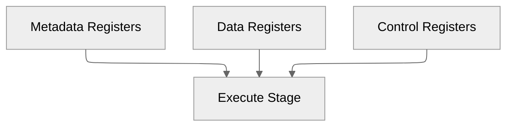

# ID/EX Pipeline Register

**Document Version:** 1.0

**Last Updated:** 2026-06-21 IST

**Implementation Status:** Implemented

**Related Modules:**

* instruction_decode
* id_ex_register
* execute_stage

---

# 1. Overview

The ID/EX Pipeline Register forms the boundary between the Instruction Decode (ID) stage and the Execute (EX) stage.

Its primary responsibility is to preserve all decoded instruction information, execution operands, metadata, and control signals generated during Decode so they can be consumed by the Execute stage during the following clock cycle.

The ID/EX register represents the transition point where an instruction ceases to be a raw instruction word and becomes a fully interpreted operation ready for execution.

---

# 2. Responsibilities

The ID/EX register performs the following functions:

* Store decoded instruction metadata
* Store source operand values
* Store generated immediates
* Store execution control signals
* Support pipeline stalls
* Support future pipeline flushing
* Preserve instruction validity
* Isolate Decode timing from Execute timing

---

# 3. Pipeline Context


Instruction lifecycle:


At this boundary:

```text
Instruction Decoding Completed

Control Generation Completed

Immediate Generation Completed

Register Reads Completed
```

The Execute stage no longer interprets opcodes directly.

Instead, it consumes:

```text
Operands
+
Metadata
+
Control Signals
```

already prepared by Decode.

---

# 4. Pipeline Interfaces

## Inputs

### Metadata

| Signal    | Width |
| --------- | ----- |
| valid_in  | 1     |
| funct3_in | 3     |
| funct7_in | 7     |
| PC_in     | 32    |
| rd_in     | 5     |
| rs1_in    | 5     |
| rs2_in    | 5     |

---

### Data

| Signal       | Width |
| ------------ | ----- |
| immediate_in | 32    |
| rs1_data_in  | 32    |
| rs2_data_in  | 32    |

---

### Control

| Signal          | Width |
| --------------- | ----- |
| ALUOp_in        | 2     |
| RegWrite_in     | 1     |
| ImmSel_in       | 3     |
| MemWrite_in     | 1     |
| MemRead_in      | 1     |
| Jump_in         | 1     |
| I_TYPE_JALR_in  | 1     |
| J_TYPE_JAL_in   | 1     |
| Branch_in       | 1     |
| ALUSrc_in       | 1     |
| ALUSrcA_in      | 1     |
| WritebackSel_in | 3     |

---

### Pipeline Control

| Signal | Width |
| ------ | ----- |
| CLK    | 1     |
| reset  | 1     |
| stall  | 1     |
| flush  | 1     |

---

# 5. Outputs

The register reproduces all stored signals for use by the Execute stage.

Outputs are grouped identically:

```text
Metadata Outputs

Data Outputs

Control Outputs
```

---

# 6. Internal Organization

The ID/EX register is organized into three logical groups.



This separation improves readability, debugging, and verification.

---

# 7. Metadata Registers

Metadata registers describe the instruction but do not directly participate in arithmetic computation.

Stored fields:

| Signal | Width |
| ------ | ----- |
| valid  | 1     |
| funct3 | 3     |
| funct7 | 7     |
| PC     | 32    |
| rd     | 5     |
| rs1    | 5     |
| rs2    | 5     |

Purpose:

```text
Instruction Identity

Instruction Context

Destination Tracking
```

These fields remain available throughout later pipeline stages.

---

# 8. Data Registers

Data registers contain values required for execution.

Stored fields:

| Signal    | Width |
| --------- | ----- |
| Immediate | 32    |
| rs1_data  | 32    |
| rs2_data  | 32    |

Purpose:

```text
ALU Operands

Address Generation

Branch Target Generation

Store Data Preservation
```

---

# 9. Control Registers

Control registers store execution decisions generated during Decode.

Stored fields:

| Signal       |
| ------------ |
| ALUOp        |
| RegWrite     |
| ImmSel       |
| MemWrite     |
| MemRead      |
| Jump         |
| I_TYPE_JALR  |
| J_TYPE_JAL   |
| Branch       |
| ALUSrc       |
| ALUSrcA      |
| WritebackSel |

These signals determine the behavior of:

```text
Execute Stage

Memory Stage

Writeback Stage
```

No additional instruction decoding occurs beyond this point.

---

# 10. Pipeline Control Behavior

## Stall Operation

Pipeline stalls are implemented through register write-enable control.

Implementation:

```text
Write_Enable = NOT(stall)
```

Behavior:

| stall | Operation                 |
| ----- | ------------------------- |
| 0     | Capture new values        |
| 1     | Preserve current contents |

Operation:

```text
stall = 1

→ Entire instruction state frozen
```

including:

```text
Metadata

Data

Control Signals
```

This allows future hazard handling mechanisms to pause pipeline progress without losing state.

---

## Flush Operation

The ID/EX register provides hardware support for pipeline flushing.

Intended behavior:

```text
flush = 1

valid_out        ← 0

funct3_out       ← 0
funct7_out       ← 0

PC_out           ← 0

rd_out           ← 0
rs1_out          ← 0
rs2_out          ← 0

immediate_out    ← 0

ALUOp_out        ← 0
RegWrite_out     ← 0
ImmSel_out       ← 0
MemWrite_out     ← 0
MemRead_out      ← 0
Jump_out         ← 0
I_TYPE_JALR_out  ← 0
J_TYPE_JAL_out   ← 0
Branch_out       ← 0
ALUSrc_out       ← 0
ALUSrcA_out      ← 0
WritebackSel_out ← 0

rs1_data_out     ← 0
rs2_data_out     ← 0
```

This injects a bubble into the Execute stage.

### Current Status

| Feature                   | Status      |
| ------------------------- | ----------- |
| Flush Interface           | Implemented |
| Flush Hardware Support    | Implemented |
| Flush Control Integration | Pending     |

---

## Reset Operation

Reset clears all stored pipeline state.

Operation:

```text
reset = 1

All outputs ← 0
valid_out ← 0
```

Following reset, no valid instructions remain in the pipeline.

---

# 11. Architectural Significance

The ID/EX register represents the point at which instruction interpretation becomes architectural state.

Before ID/EX:

```text
Instruction Exists
```

After ID/EX:

```text
Instruction Meaning Exists
```

The Execute stage no longer requires:

```text
Opcode

Instruction Classification

Immediate Extraction
```

All interpretation has already been completed.

---

# 12. Architectural Decisions

## Decision: Full Control Signal Pipelining

### Decision

All Decode-generated control signals are stored within the ID/EX register.

### Rationale

Later stages should not re-decode instructions.

### Benefits

* Cleaner stage boundaries
* Reduced duplicated logic
* Improved modularity
* Easier verification

---

## Decision: Metadata / Data / Control Separation

### Decision

The register is physically organized into:

```text
Metadata Registers

Data Registers

Control Registers
```

### Benefits

* Improved readability
* Easier debugging
* Better maintainability
* Simplified verification

### Tradeoffs

* Slightly larger implementation footprint

---

## Decision: Stall Through Write Enable Control

### Decision

Pipeline stalls are implemented through register write-enable gating.

Implementation:

```text
WE = NOT(stall)
```

### Benefits

* Simple implementation
* Preserves complete instruction state
* Easy hazard integration

---

## Decision: Early Flush Provisioning

### Decision

Flush support was included before hazard integration.

### Benefits

* Future branch recovery support
* Future hazard recovery support
* Avoids redesign of pipeline interfaces

---

# 13. Implementation Notes

* Implemented using individual register elements.
* Register groups are physically separated by function.
* Control signals remain synchronized with associated operands.
* All execution information required by EX stage is preserved.
* Flush interfaces have been architecturally provisioned.
* Stall implementation is identical to IF/ID register design.

---

# 14. Validation Status

## Verified

* [x] Metadata propagation
* [x] Operand propagation
* [x] Immediate propagation
* [x] Control signal propagation
* [x] Stall behavior
* [x] Reset behavior

## Pending Validation

* [ ] Flush integration testing
* [ ] Hazard interaction testing
* [ ] Branch recovery testing

---

# 15. Future Enhancements

* Hazard Detection Unit integration
* Forwarding Unit integration
* Branch recovery integration
* Exception recovery support
* Performance monitoring support

---

# 16. Revision History

| Version | Date       | Changes                                       |
| ------- | ---------- | --------------------------------------------- |
| 1.0     | 2026-06-21 | Initial ID/EX Pipeline Register documentation |

---