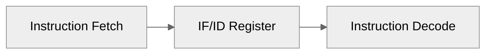
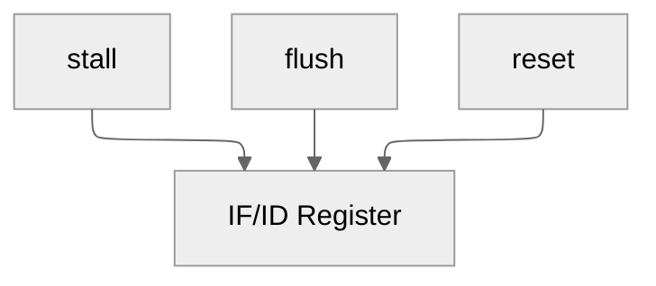
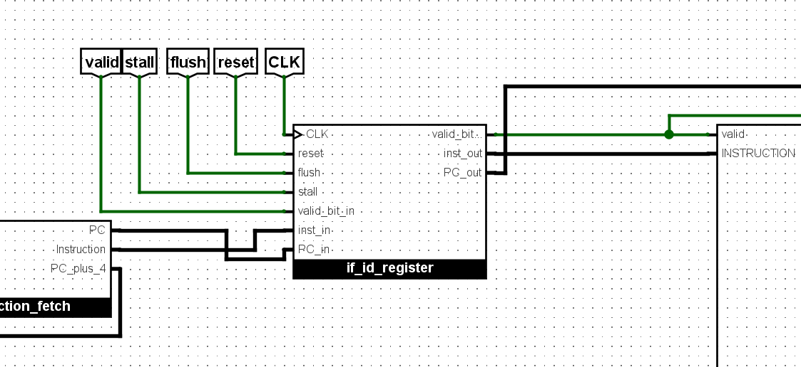
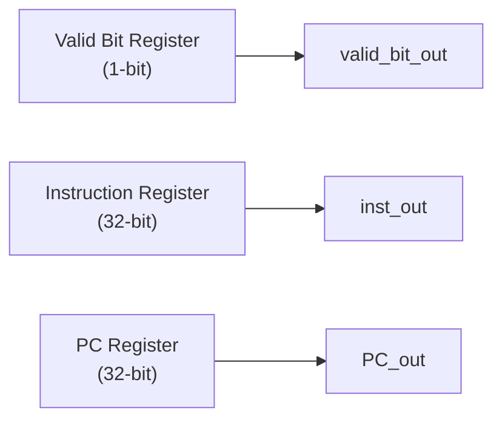
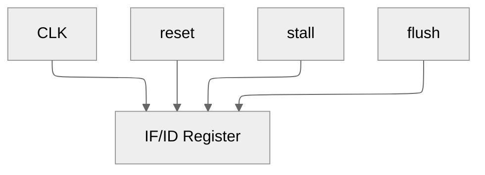
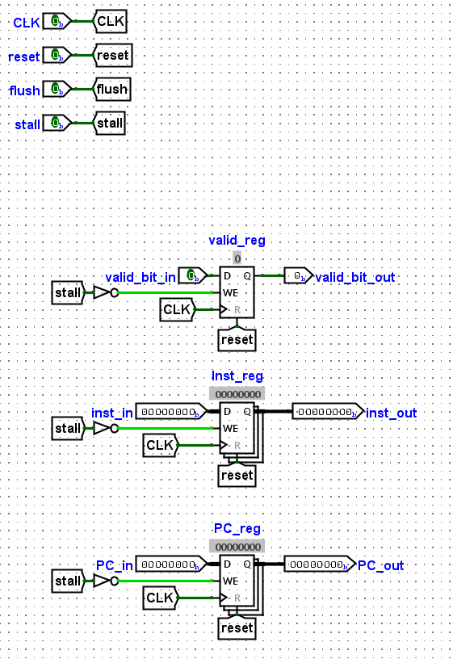

# IF/ID Pipeline Register

**Document Version:** 1.0

**Last Updated:** 2026-06-21 16:35 IST

**Implementation Status:** Implemented

**Related Modules:**

* if_id_register
* instruction_fetch
* instruction_decode

---

# 1. Overview

The IF/ID Pipeline Register forms the boundary between the Instruction Fetch (IF) stage and the Instruction Decode (ID) stage.

Its primary responsibility is to capture and preserve instruction fetch results at the end of each clock cycle, allowing the Decode stage to operate independently from subsequent instruction fetch operations.

The register also provides fundamental pipeline control interfaces required for future hazard handling and control-flow recovery mechanisms.

---

# 2. Responsibilities

The IF/ID Pipeline Register performs the following functions:

* Store fetched instruction information
* Isolate Fetch and Decode stage timing
* Support pipeline stalling
* Support pipeline flushing
* Track instruction validity
* Enable bubble insertion into the pipeline

---

# 3. Pipeline Context



Pipeline control interfaces:


---

---

# 4. Pipeline Interfaces

## Inputs

| Signal       | Width | Description                                 |
| ------------ | ----- | ------------------------------------------- |
| CLK          | 1     | System clock                                |
| reset        | 1     | Synchronous reset signal                    |
| stall        | 1     | Pipeline stall request                      |
| flush        | 1     | Pipeline flush request                      |
| valid_bit_in | 1     | Validity indicator from Fetch stage         |
| inst_in      | 32    | Fetched instruction                         |
| PC_in        | 32    | Program Counter associated with instruction |

---

## Outputs

| Signal        | Width | Description                    |
| ------------- | ----- | ------------------------------ |
| valid_bit_out | 1     | Instruction validity indicator |
| inst_out      | 32    | Latched instruction            |
| PC_out        | 32    | Latched Program Counter        |

---

# 5. Internal Architecture



Control signal organization:


---

---

# 6. Stored State Elements

## Valid Bit Register

Stores the legitimacy status of the pipeline entry.

### Width

```text
1 Bit
```

### Purpose

The valid bit indicates whether the pipeline entry contains a real instruction or a bubble.

Operation:

```text
valid_bit_out = 1
    → Valid instruction

valid_bit_out = 0
    → Bubble / Invalid pipeline entry
```

---

## Instruction Register

Stores the instruction fetched during the Instruction Fetch stage.

### Width

```text
32 Bits
```

### Purpose

Preserves instruction information for use by the Instruction Decode stage.

---

## Program Counter Register

Stores the Program Counter corresponding to the fetched instruction.

### Width

```text
32 Bits
```

### Purpose

Provides instruction address context to downstream stages.

The stored PC is used for:

* Branch target generation
* Jump calculations
* Debugging support
* Exception support (future)

---

# 7. Pipeline Control Behavior

## Stall Behavior

Pipeline stalls prevent the IF/ID register from accepting new values.

Implementation:

```text
Write_Enable = NOT(stall)
```

Behavior:

| stall | Operation                |
| ----- | ------------------------ |
| 0     | Capture new inputs       |
| 1     | Retain previous contents |

Operation:

```text
stall = 0
    → Register updates normally

stall = 1
    → Register contents remain unchanged
```

---

## Flush Behavior

The IF/ID register provides hardware support for pipeline flushing.

Intended behavior:

```text
flush = 1

valid_bit_out ← 0
inst_out      ← 0
PC_out        ← 0
```

This operation removes incorrectly fetched instructions from the pipeline and injects a bubble.

### Current Status

| Feature                   | Status      |
| ------------------------- | ----------- |
| Flush Interface           | Implemented |
| Flush Hardware Support    | Implemented |
| Flush Control Integration | Pending     |

The flush interface has been provisioned for future branch recovery and hazard control mechanisms.

---

## Reset Behavior

Reset clears all stored pipeline state.

Operation:

```text
reset = 1

valid_bit_out ← 0
inst_out      ← 0
PC_out        ← 0
```

Following reset, the pipeline contains no valid instructions.

---

# 8. Architectural Decisions

## Decision: Dedicated Valid Bit Tracking

### Decision

A dedicated valid bit register is maintained alongside pipeline data.

### Rationale

Instruction validity is tracked independently of datapath contents.

### Benefits

* Simplifies bubble insertion
* Enables future hazard handling
* Supports pipeline flushing
* Facilitates exception recovery

### Tradeoffs

* Additional register storage required

---

## Decision: Stall Through Write Enable Control

### Decision

Pipeline stalls are implemented by controlling register write enables.

Implementation:

```text
WE = NOT(stall)
```

### Rationale

Preventing register updates naturally freezes pipeline state.

### Benefits

* Minimal control complexity
* Efficient implementation
* Easy integration with hazard detection logic

### Tradeoffs

* Requires dedicated stall signal generation

---

## Decision: Flush Support Provisioned Early

### Decision

Flush interfaces were incorporated before hazard logic implementation.

### Rationale

Future control mechanisms can be integrated without redesigning pipeline registers.

### Benefits

* Improved scalability
* Reduced future integration effort
* Clear pipeline control interfaces

### Tradeoffs

* Flush functionality currently awaits control-path integration

---

# 9. Implementation Notes

* Implemented using individual register components.
* Valid bit, instruction, and PC are stored independently.
* Stall control is implemented through register write-enable gating.
* Flush support has been architecturally provisioned.
* Reset behavior clears all pipeline state.
* Modular organization improves observability and debugging.

---

# 10. Validation Status

## Verified

* [x] Instruction propagation through pipeline boundary
* [x] Program Counter propagation
* [x] Valid bit propagation
* [x] Stall behavior through write-enable control
* [x] Reset behavior

## Pending Validation

* [ ] Flush control integration
* [ ] Bubble insertion testing
* [ ] Hazard-driven stall validation

---

# 11. Future Enhancements

* Hazard Detection Unit integration
* Branch recovery support
* Pipeline flush control integration
* Exception recovery support
* Performance monitoring support

---

# 12. Revision History

| Version | Date       | Changes                              |
| ------- | ---------- | ------------------------------------ |
| 1.0     | 2026-06-15 | Initial implementation documentation |
