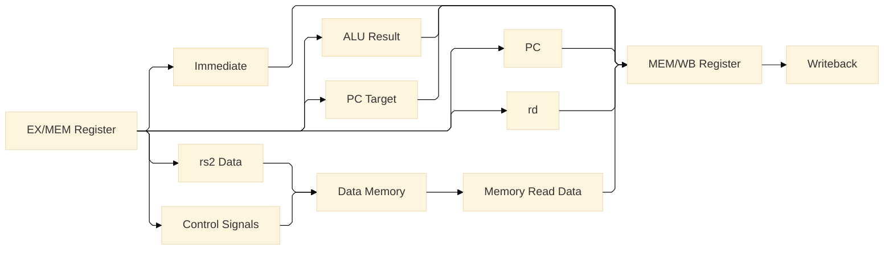
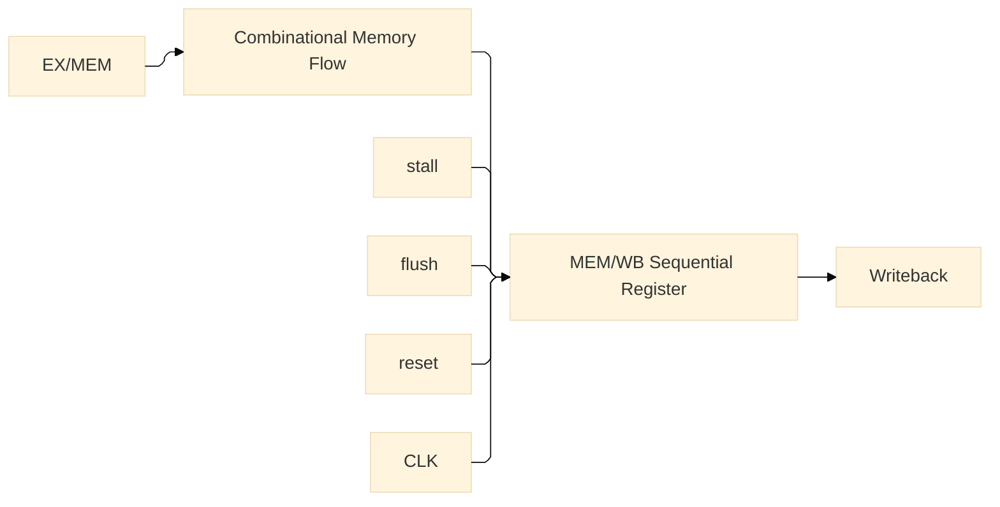
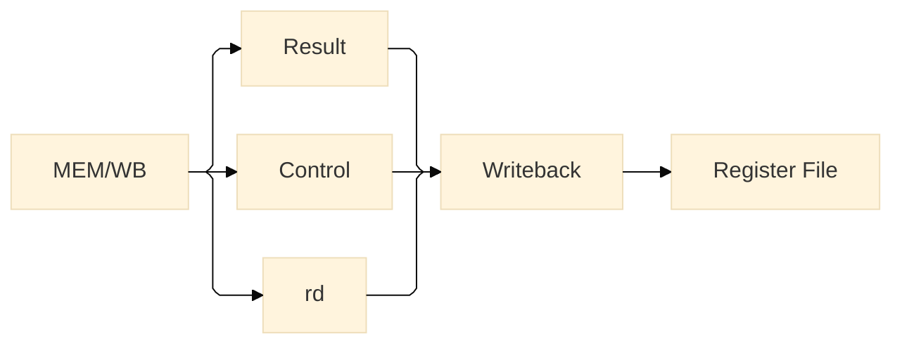

# MEM/WB Pipeline Register

**Document Version:** v1.0  
**Date:** 2026-07-22  13:40 IST
**Implementation Status:** Implemented

---

# 1. Overview

The MEM/WB Pipeline Register is the sequential boundary between the Memory
(MEM) stage and the Writeback (WB) stage.

Its purpose is to capture the outputs and required control information from the
Memory stage on the active clock edge and hold them stable for the subsequent
Writeback stage.

The register preserves both datapath values and instruction-control metadata
required to complete the instruction.

The implemented MEM/WB register carries:

- Pipeline validity
- PC target address
- ALU result
- Destination register
- PC
- Immediate
- Register-write control
- Writeback source selection
- Memory-read control

---

# 2. Pipeline Position

The MEM/WB register is positioned directly between the Memory and Writeback
stages.


The MEM/WB register therefore establishes the clocked boundary between memory
access and  register writeback.

---

# 3. Functional Responsibility

The MEM/WB register performs no combinational instruction execution.

Its responsibility is to:

1. Receive values from the MEM stage.
2. Capture those values on the active clock edge.
3. Preserve them for the WB stage.
4. Propagate the associated control information.
5. Carry the instruction validity state through the pipeline.
6. Provide sequential control interfaces for reset, stall, and flush.


---

# 4. Input Interface

The implemented register receives the following signals.

## 4.1 Pipeline Data

| Signal          | Width | Description                                            |
| --------------- | ----: | ------------------------------------------------------ |
| `pc_target_in`  |    32 | Target address generated for control-flow instructions |
| `ALU_Result_in` |    32 | Result generated by the Execute stage                  |
| `rd_in`         |     5 | Destination register index                             |
| `PC_in`         |    32 | Program-counter value associated with the instruction  |
| `immediate_in`  |    32 | Instruction immediate value                            |
| `rs2_data_in`   |    32 | Store data forwarded to the Memory stage               |

`rs2_data_in` is used by the Memory stage for store operations and does not
become a MEM/WB architectural output.

---

## 4.2 Memory Control

| Signal        | Width | Description          |
| ------------- | ----: | -------------------- |
| `MemWrite_in` |     1 | Memory write control |
| `MemRead_in`  |     1 | Memory read control  |

`MemWrite_in` is consumed by the data-memory subsystem and therefore does not
need to be propagated to Writeback.

`MemRead_in` is captured by the MEM/WB register as part of the implemented
pipeline interface.

---

## 4.3 Writeback Control

| Signal            | Width | Description                                                |
| ----------------- | ----: | ---------------------------------------------------------- |
| `RegWrite_in`     |     1 | Indicates that the instruction can write the register file |
| `WritebackSel_in` |     3 | Selects the Writeback data source                          |

`WritebackSel` is intentionally implemented as a 3-bit control field to allow
future expansion of Writeback sources.

---

## 4.4 Pipeline State

| Signal     | Width | Description                                                       |
| ---------- | ----: | ----------------------------------------------------------------- |
| `valid_in` |     1 | Indicates whether the pipeline entry contains a valid instruction |

---

## 4.5 Sequential Control

| Signal  | Width | Description                              |
| ------- | ----: | ---------------------------------------- |
| `CLK`   |     1 | Pipeline clock                           |
| `reset` |     1 | Sequential register reset                |
| `stall` |     1 | Sequential state-hold control            |
| `flush` |     1 | Sequential pipeline invalidation control |

These signals affect the sequential register state only.

They do not participate in the combinational Memory datapath.

---

# 5. Output Interface

The implemented MEM/WB register provides the following outputs.

## 5.1 Pipeline Data

| Signal           | Width | Description                           |
| ---------------- | ----: | ------------------------------------- |
| `pc_target_out`  |    32 | Forwarded control-flow target address |
| `ALU_Result_out` |    32 | Forwarded ALU result                  |
| `rd_out`         |     5 | Destination register index            |
| `PC_out`         |    32 | Forwarded program-counter value       |
| `immediate_out`  |    32 | Forwarded immediate value             |

---

## 5.2 Memory Data

| Signal          | Width | Description                                |
| --------------- | ----: | ------------------------------------------ |
| `mem_read_data` |    32 | Data returned by the data-memory subsystem |

The memory-read data is captured by the MEM/WB register before being consumed
by the Writeback stage.

The current implementation uses an asynchronous-read data-memory subsystem,
therefore the memory data is available combinationally from the memory
subsystem and is subsequently captured by the sequential MEM/WB boundary.

---

## 5.3 Writeback Control

| Signal             | Width | Description                          |
| ------------------ | ----: | ------------------------------------ |
| `RegWrite_out`     |     1 | Forwarded register-write control     |
| `WritebackSel_out` |     3 | Forwarded Writeback source selection |
| `MemRead_out`      |     1 | Forwarded memory-read indication     |

---

## 5.4 Pipeline State

| Signal      | Width | Description                                 |
| ----------- | ----: | ------------------------------------------- |
| `valid_out` |     1 | Validity state of the MEM/WB pipeline entry |

---

# 6. Implemented Data Flow

The complete implemented relationship is:



---

# 7. Memory Interaction

The MEM/WB register is the receiving boundary for the data produced by the
data-memory subsystem.

For a load instruction:

```text
EX/MEM
   │
   ├── address
   ├── MemRead
   │
   ▼
Data Memory
   │
   │ READ_DATA
   ▼
MEM/WB Register
   │
   ▼
Writeback
```

For a store instruction, `rs2_data` and the memory-write control are consumed
by the data-memory subsystem in the MEM stage.

The store data itself is not required by the Writeback stage and therefore is
not propagated through the MEM/WB register.

---

# 8. Writeback Interface

The MEM/WB register supplies the Writeback stage with the values required to
select the final architectural result.

The Writeback stage receives:

```text
ALU_Result
PC
Memory Read Data
Immediate
WritebackSel
```

and determines the value ultimately written to the register file.

The destination register is supplied through:

```text
rd_out
```

The register-write control is supplied through:

```text
RegWrite_out
```

The validity state is supplied through:

```text
valid_out
```

The effective register-file write enable is therefore controlled by both
instruction validity and the propagated `RegWrite` signal.

```text
Register Write Enable
        =
RegWrite_out AND valid_out
```

---

# 9. Writeback Source Selection

The `WritebackSel` field is propagated through the MEM/WB boundary and is
consumed by the Writeback stage.

Current architectural Writeback sources include:

* ALU result
* Memory data
* PC-related value
* Immediate value

The field is 3 bits wide to accommodate additional Writeback sources in future
revisions.

The MEM/WB register does not perform this selection.

It only preserves the selection control until the Writeback stage.

---

# 10. Valid Bit

The `valid` bit travels with the instruction through the pipeline.


A `valid_out = 1` indicates that the MEM/WB entry represents a valid pipeline
instruction.

A `valid_out = 0` represents an invalid pipeline entry or bubble.

This prevents invalid pipeline state from being treated as a valid
architectural operation.

---

# 11. Clocked Operation

The MEM/WB register is a sequential component.

At the active clock edge, the register captures the currently presented MEM
stage values according to its sequential-control inputs.

Conceptually:

```text
MEM stage outputs
       │
       ▼
   [ D inputs ]
       │
      CLK
       │
       ▼
   [ MEM/WB ]
       │
       ▼
WB stage inputs
```

Once captured, the outputs remain stable until the next state transition.

---

# 12. Stall Interface

The `stall` input belongs to the sequential pipeline-control interface.

When a stall condition is asserted, the MEM/WB register is intended to hold its
current sequential state rather than advancing new pipeline information.

```text
stall
  │
  ▼
MEM/WB state hold
```

Stall control is not part of the Memory stage's combinational data flow.

The functional stall mechanism is reserved for the pipeline hazard-control
implementation.

---

# 13. Flush Interface

The `flush` input provides the sequential pipeline-control interface required
for future control-flow recovery.

The intended architectural behavior is to invalidate the pipeline entry when
a flush is requested.

Conceptually:

```text
flush
  │
  ▼
MEM/WB invalidation
  │
  ▼
valid_out = 0
```

The current project revision has the flush interface physically integrated
with the pipeline registers, but the complete flush mechanism has not yet been
implemented or verified.

---

# 14. Reset Interface

The `reset` input initializes the sequential state of the MEM/WB register.

The validity state is cleared during reset so that stale pipeline information
cannot be interpreted as a valid instruction.

```text
reset
  │
  ▼
MEM/WB state initialization
  │
  ▼
valid_out = 0
```

---

# 15. Separation of Combinational and Sequential Logic

The MEM/WB boundary deliberately separates the combinational Memory stage
from the sequential pipeline state.



The following principles apply:

* Memory datapath operations remain combinational.
* `stall` affects sequential state.
* `flush` affects sequential state.
* `reset` affects sequential state.
* `CLK` establishes the pipeline timing boundary.

---

# 16. Architectural Role

The MEM/WB register ensures that the Writeback stage receives a complete and
time-aligned instruction context.

It carries the information required to perform the final architectural update:



This boundary prevents combinational Memory-stage activity from directly
driving the architectural register state.

---

# 17. Related Modules

The MEM/WB register is directly related to:

* `ex_mem_register`
* `data_memory_subsystem`
* `mem_wb_register`
* `writeback`
* `register_file_subsystem`
* `pc_control_unit`
* Future `hazard_detection_unit`
* Future `forwarding_unit`
* Pipeline control and flush logic

The register-file architecture is documented separately and is referenced by
the Writeback stage documentation.

---

# 18. Implementation Summary

The implemented MEM/WB register contains:

```text
Datapath
├── pc_target
├── ALU_Result
├── rd
├── PC
├── immediate
└── memory read data

Control
├── RegWrite
├── WritebackSel [3 bits]
└── MemRead

Pipeline State
└── valid

Sequential Control
├── CLK
├── reset
├── stall
└── flush
```

The register provides the sequential boundary between the Memory and Writeback
stages and preserves the instruction context required for final execution.

---

# 19. Implementation Status

**Implementation Status:** Implemented

Implemented elements:

* MEM/WB sequential register
* ALU result pipeline storage
* PC pipeline storage
* PC target pipeline storage
* immediate pipeline storage
* destination-register storage
* memory-read-data capture
* `RegWrite` propagation
* `WritebackSel` propagation
* `MemRead` propagation
* valid-bit propagation
* clock interface
* reset interface
* stall interface
* flush interface

The stall and flush interfaces are integrated at the register boundary for
pipeline-control expansion. Their complete hazard-management behavior belongs
to the future pipeline-control implementation.

---

# 20. Revision History

| Version | Date       | Description                                                                   |
| ------- | ---------- | ----------------------------------------------------------------------------- |
| v1.0    | 2026-07-22 | Initial implementation documentation of the MEM/WB pipeline register |

```

**One deliberate architectural distinction:** `MemWrite` and `rs2_data` remain in the MEM-side path because they are consumed by the data-memory subsystem; they are **not unnecessarily carried into WB**. This keeps the MEM/WB boundary aligned with what the actual circuit is doing rather than turning it into a generic “carry everything forward” register.
```
