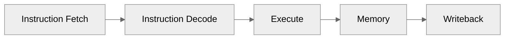
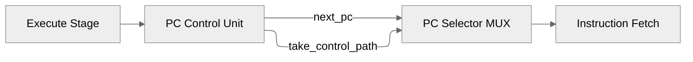
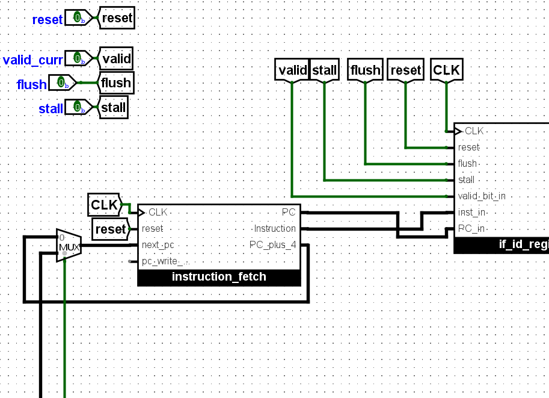
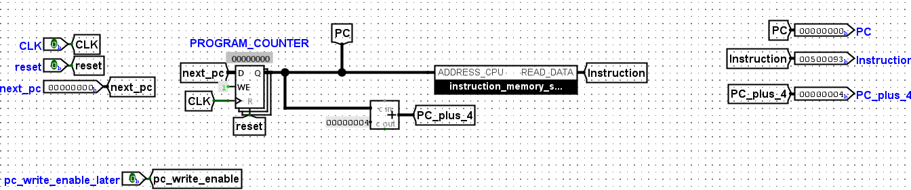
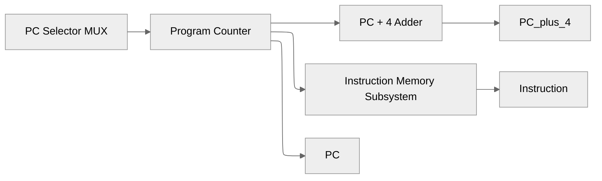
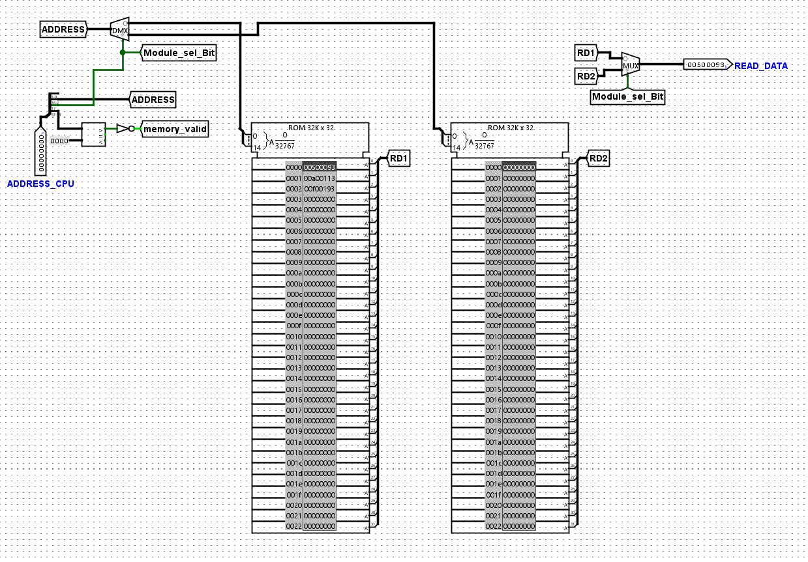

# Instruction Fetch (IF) Stage

**Document Version:** 1.0

**Last Updated:** 2026-06-15 21:48 IST

**Implementation Status:** Implemented and Verified

**Related Modules:**

* instruction_fetch
* instruction_memory_subsystem
* if_id_register
* pc_control_unit

---

# 1. Overview

The Instruction Fetch (IF) Stage is responsible for supplying a continuous stream of instructions to the processor pipeline.

The stage maintains the Program Counter (PC), determines the next instruction address, accesses instruction memory, generates the sequential instruction address (`PC + 4`), and provides fetched instruction information to the Instruction Decode stage.

Control-flow redirection resulting from branch and jump instructions is handled through feedback from the Execute stage.

---

# 2. Responsibilities

The Instruction Fetch stage performs the following functions:

* Maintain the Program Counter (PC)
* Select the next Program Counter value
* Fetch instructions from instruction memory
* Generate the sequential address (`PC + 4`)
* Support control-flow redirection
* Interface with the IF/ID pipeline register

---

# 3. Pipeline Context



Control-flow feedback:



---

# 4. Pipeline Interfaces

## Inputs

| Signal            | Width | Description                     |
| ----------------- | ----- | ------------------------------- |
| CLK               | 1     | System clock                    |
| reset             | 1     | Synchronous reset               |
| next_pc           | 32    | Branch/jump target address      |
| pc_write_enable   | 1     | Program Counter write enable    |
| take_control_path | 1     | Control-flow redirection select |

---

## Outputs

| Signal      | Width | Description                         |
| ----------- | ----- | ----------------------------------- |
| PC          | 32    | Current instruction byte address    |
| Instruction | 32    | Fetched instruction                 |
| PC_plus_4   | 32    | Sequential next instruction address |
---


# 5. Internal Architecture





---

# 6. Component Description

## 6.1 Program Counter Register

The Program Counter stores the byte address of the instruction currently being fetched.

### Characteristics

| Property         | Value                 |
| ---------------- | --------------------- |
| Width            | 32 bits               |
| Reset Value      | `0x00000000`          |
| Address Type     | Byte Address          |
| Update Condition | `pc_write_enable = 1` |

### Update Behavior

```text
On Rising Clock Edge:

if reset:
    PC ← 0x00000000

else if pc_write_enable:
    PC ← Selected_Next_PC
```

The write-enable mechanism provides future support for:

* Pipeline stalls
* Hazard handling
* Pipeline control logic

---

## 6.2 PC Selector Multiplexer

The PC Selector Multiplexer determines the source of the next Program Counter value.

### Inputs

| Input   | Source                          |
| ------- | ------------------------------- |
| Input 0 | Sequential address (`PC + 4`)   |
| Input 1 | Control-flow target (`next_pc`) |

### Select Signal

```text
take_control_path
```

### Operation

```text
take_control_path = 0
    → Sequential Execution

take_control_path = 1
    → Branch/Jump Redirection
```

---

## 6.3 PC + 4 Generation Unit

The sequential instruction address is generated using a dedicated adder.

### Operation

```text
PC_plus_4 = PC + 4
```

Since RV32I instructions are fixed-width 32-bit instructions:

```text
Instruction Size = 4 Bytes
```

the Program Counter advances by four bytes during sequential execution.

### Usage

The generated value is used for:

* Sequential instruction fetch
* JAL link address generation
* JALR link address generation
* Pipeline propagation

---

## 6.4 Instruction Memory Subsystem

The Instruction Memory Subsystem provides instruction fetch capability.

### Configuration

```text
2 × ROM (32K × 32)
```

Combined capacity:

```text
64K words × 32 bits

256 KB Instruction Memory
```

---

### Address Translation

The processor uses byte-addressed memory while ROM modules operate using word addresses.

```text
CPU Address  → Byte Address

ROM Address  → Word Address
```

Address conversion:

```text
ROM_Address = PC[17:2]
```

---

### Address Mapping

| PC Bits   | Function              |
| --------- | --------------------- |
| PC[1:0]   | Ignored (byte offset) |
| PC[16:2]  | Internal ROM address  |
| PC[17]    | ROM bank selection    |
| PC[31:18] | Address validation    |

---

### Bank Selection

Instruction memory is organized using two ROM banks.

```text
PC[17]

0 → ROM0

1 → ROM1
```

A multiplexer selects the output of the active ROM bank.

This structure supports future memory expansion while maintaining modular memory organization.

---

### Address Validation

Instruction fetches are validated using upper address bits.

Validation logic:

```text
memory_valid = NOT(OR(PC[31:18]))
```

Only addresses within the implemented instruction memory space are considered valid.

This mechanism establishes a foundation for future:

* Exception handling
* Address fault detection
* Memory protection support

---

# 7. Architectural Decisions

## Decision: Late Branch Resolution

### Decision

Branch and jump decisions are resolved during the Execute stage.

The Execute stage generates:

* `take_control_path`
* `next_pc`

which are fed back to the Fetch stage.

### Rationale

* Simplifies Fetch stage logic
* Centralizes control-flow decision making
* Aligns with classical five-stage RISC pipelines

### Benefits

* Reduced control complexity
* Modular pipeline organization
* Easier verification

### Tradeoffs

* Introduces branch penalty
* Requires future flush support

---

## Decision: Byte-Addressed Program Counter

### Decision

The Program Counter stores byte addresses.

Instruction memory internally uses word addressing.

### Rationale

RISC-V defines memory using byte addressing.

### Benefits

* ISA compliance
* Simplifies future support for variable-width memory accesses

### Tradeoffs

* Requires address translation (`>> 2`) before memory access

---

## Decision: Dual-ROM Organization

### Decision

Instruction memory is implemented using two `32K × 32` ROM modules.

### Rationale

* Circumvents single-module size limitations
* Enables scalable memory expansion

### Benefits

* Modular design
* Simple bank selection logic

### Tradeoffs

* Requires bank select multiplexing

---

# 8. Implementation Notes

* Implemented using Logisim Evolution primitives.
* Program Counter implemented using register components.
* Sequential address generation implemented using dedicated adder logic.
* Instruction memory implemented using dual ROM banks.
* Address validation implemented using combinational logic.
* Control-flow redirection support integrated during initial implementation.
* `pc_write_enable` support incorporated for future hazard management.

---

# 9. Validation Status

## Verified

* [x] Program Counter reset behavior
* [x] Sequential PC increment (`PC + 4`)
* [x] Instruction fetch operation
* [x] Instruction memory address translation
* [x] ROM bank selection
* [x] Control-flow redirection path integration

## Pending Validation

* [ ] Pipeline stall behavior
* [ ] Pipeline flush behavior
* [ ] Branch penalty recovery

---

# 10. Future Enhancements

* Pipeline flush integration
* Hazard detection support
* Branch prediction mechanisms
* Instruction cache support
* Exception and fault handling
* Speculative instruction fetch

---

# 11. Revision History

| Version | Date       | Changes                                               |
| ------- | ---------- | ----------------------------------------------------- |
| 1.0     | 2026-06-15 | Initial implementation and verification documentation |
