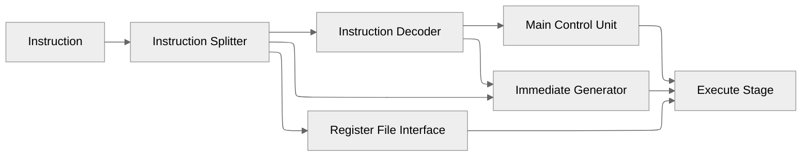
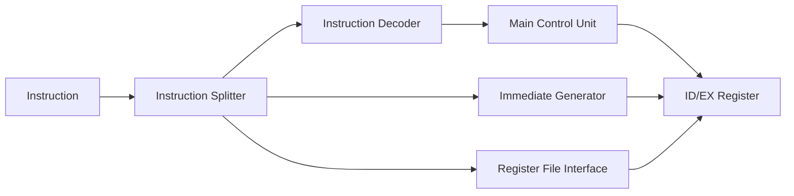
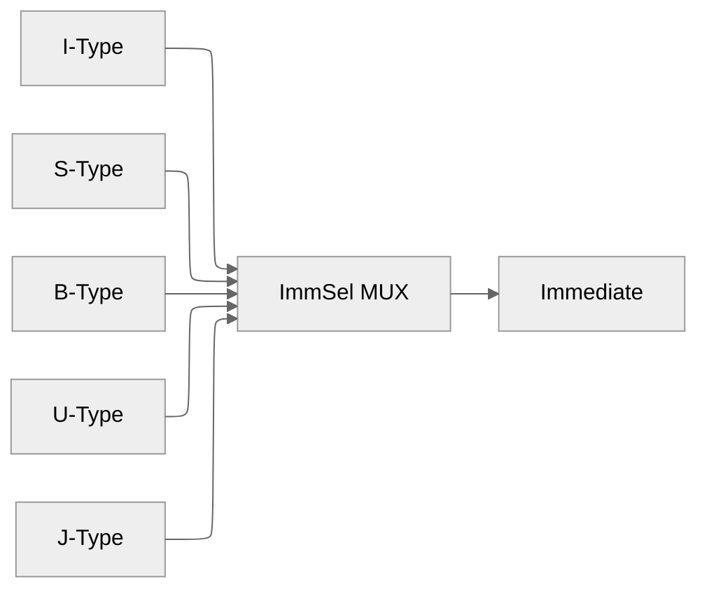

# Instruction Decode (ID) Stage

**Document Version:** 1.0

**Last Updated:** 2026-06-21 12:10 UTC

**Implementation Status:** Implemented and Verified

**Related Modules:**

* instruction_decode
* instruction_splitter
* instruction_decoder
* main_control_unit
* immediate_generator
* register_file_subsystem
* id_ex_register

---

# 1. Overview

The Instruction Decode (ID) Stage interprets instructions fetched from memory and prepares all information required by the Execute stage.

The stage performs instruction field extraction, instruction classification, control signal generation, immediate generation, and register operand acquisition.

Unlike later pipeline stages, the Decode stage does not perform arithmetic or memory operations. Its purpose is to transform a raw instruction word into structured control and data signals suitable for execution.

---

# 2. Responsibilities

The Decode stage performs the following functions:

* Extract instruction fields
* Classify instruction types
* Generate control signals
* Generate immediates
* Read source register operands
* Identify destination registers
* Forward decoded information to the Execute stage

---

# 3. Pipeline Context


Internal decode flow:



---

# 4. Pipeline Interfaces

## Inputs

| Signal      | Width | Description                     |
| ----------- | ----- | ------------------------------- |
| Instruction | 32    | Instruction from IF/ID register |
| PC          | 32    | Associated program counter      |
| Valid       | 1     | Instruction validity indicator  |

---

## Outputs

### Datapath Signals

| Signal      | Width |
| ----------- | ----- |
| rs1         | 5     |
| rs2         | 5     |
| rd          | 5     |
| funct3      | 3     |
| funct7      | 7     |
| Immediate   | 32    |
| Read_Data_1 | 32    |
| Read_Data_2 | 32    |

---

### Control Signals

| Signal       | Width |
| ------------ | ----- |
| ALUOp        | 2     |
| RegWrite     | 1     |
| ImmSel       | 3     |
| MemWrite     | 1     |
| MemRead      | 1     |
| Jump         | 1     |
| I_type_JALR  | 1     |
| J_type_JAL   | 1     |
| Branch       | 1     |
| ALUSrc       | 1     |
| ALUSrcA      | 1     |
| WritebackSel | 2     |

---

# 5. Internal Architecture



---

# 6. Instruction Splitter

The Instruction Splitter extracts architectural fields from the 32-bit RV32I instruction word.

Field extraction:

| Field  | Bits    |
| ------ | ------- |
| opcode | [6:0]   |
| rd     | [11:7]  |
| funct3 | [14:12] |
| rs1    | [19:15] |
| rs2    | [24:20] |
| funct7 | [31:25] |

These fields are distributed to downstream decode components.

---

# 7. Instruction Decoder

## Overview

The Instruction Decoder classifies instructions into architectural instruction types.

Rather than implementing a monolithic opcode decoder, the design employs a hierarchical opcode classification strategy.

This reduces decoder complexity and improves modularity.

---

## Hierarchical Decode Architecture

### Stage 1 — Broad Classification

The decoder first evaluates:

```text
Opcode[6:5]
```

using a decoder structure.

This partitions instructions into major opcode groups.

---

### Stage 2 — Refinement

The resulting groups are refined using:

```text
Opcode[4:2]
```

through demultiplexer-based classification.

---

### Stage 3 — Tie Breaking

Remaining ambiguities are resolved using:

```text
Opcode[3]
```

Examples include:

```text
JAL
JALR
```

which share common upper-bit classifications.

---

## Generated Instruction Types

The decoder identifies:

```text
LOAD

STORE

OP-IMM

OP

LUI

AUIPC

BRANCH

JAL

JALR

SYSTEM

MISC-MEM
```

These instruction-type signals are forwarded to the Main Control Unit.

---

# 8. Main Control Unit

## Overview

The Main Control Unit converts instruction classifications into control signals used throughout the pipeline.

Control generation is entirely combinational.

---

## Generated Control Signals

### Register Control

```text
RegWrite
```

Enables architectural register updates.

---

### Memory Control

```text
MemRead

MemWrite
```

Control memory access operations.

---

### Immediate Control

```text
ImmSel
```

Selects the required immediate format.

---

### Execute Control

```text
ALUOp

ALUSrc

ALUSrcA
```

Control operand selection and ALU operation classification.

---

### Control Flow

```text
Jump

Branch

J_type_JAL

I_type_JALR
```

Identify control-flow instructions.

---

### Writeback Control

```text
WritebackSel
```

Selects the source returned to the architectural register file.

---

# 9. Immediate Generator

## Overview

The Immediate Generator constructs all RV32I immediate formats.

Generation occurs in parallel.

A final multiplexer selects the required immediate according to `ImmSel`.

---

## Supported Formats

### I-Type

Used by:

```text
OP-IMM

LOAD

JALR
```

---

### S-Type

Used by:

```text
STORE
```

---

### B-Type

Used by:

```text
BRANCH
```

---

### U-Type

Used by:

```text
LUI

AUIPC
```

---

### J-Type

Used by:

```text
JAL
```

---

## Immediate Selection



---

# 10. Register File Interface

The architectural register file is implemented externally to the Decode stage.

The Decode stage interacts with the register file through:

```text
rs1

rs2

rd
```

address signals.

Read operations:

```text
Read_Data_1 ← Register[rs1]

Read_Data_2 ← Register[rs2]
```

Detailed register file organization is documented separately in:

```text
register_file_subsystem.md
```

---

# 11. Operand Preparation

The Decode stage generates operand selection controls used by the Execute stage.

## Operand A Selection

```text
ALUSrcA

0 → rs1

1 → PC
```

Used by:

```text
AUIPC

JAL

JALR

Branch Target Generation
```

---

## Operand B Selection

```text
ALUSrc

0 → rs2

1 → Immediate
```

Used by:

```text
Immediate Arithmetic

Loads

Stores

Address Generation
```

---

# 12. Architectural Decisions

## Decision: Hierarchical Instruction Decoder

### Decision

Opcode decoding is performed through progressive classification rather than a monolithic decoder.

### Rationale

The RV32I opcode space contains significant structure that can be exploited through staged decoding.

### Benefits

* Reduced decoder complexity
* Smaller logic fan-in
* Improved modularity
* Easier verification
* Easier debugging

### Tradeoffs

* Additional decode stages required

---

## Decision: Parallel Immediate Generation

### Decision

All immediate formats are generated simultaneously.

### Benefits

* Simplified control logic
* Modular implementation
* Easier verification

### Tradeoffs

* Additional combinational hardware

---

## Decision: External Register File Placement

### Decision

The register file is implemented outside the Decode stage.

### Rationale

Register writes occur during Writeback several pipeline stages later.

### Benefits

* Cleaner pipeline boundaries
* Simpler writeback integration
* Improved modularity

---

# 13. Implementation Notes

* Implemented using modular subcircuits.
* Decoder constructed using decoder and demultiplexer structures.
* Immediate generation is fully parallel.
* Register file reads occur during Decode.
* Register file writes are performed during Writeback.
* All control signals are generated combinationally.

---

# 14. Validation Status

## Verified

* [x] Instruction field extraction
* [x] Opcode classification
* [x] Control signal generation
* [x] Immediate generation
* [x] Register operand acquisition
* [x] Pipeline integration

## Pending Validation

* [ ] Complete RV32I instruction validation
* [ ] Hazard interaction testing
* [ ] Flush interaction testing

---

# 15. Future Enhancements

* Hazard Detection Unit integration
* CSR Decode Unit integration
* Branch Decode Unit integration
* Exception support
* Privileged instruction support

---

# 16. Revision History

| Version | Date       | Changes                            |
| ------- | ---------- | ---------------------------------- |
| 1.0     | 2026-06-21 | Initial Decode Stage documentation |
