# 03 Execute Stage

**Document Version:** 1.0

**Last Updated:** 2026-07-17 12:10 IST

**Implementation Status:** Implemented and Verified
---

# 1. Purpose

The Execute (EX) stage performs arithmetic operations, logical operations,
comparisons, branch evaluation, and target address generation.

It receives operands and control signals from the ID/EX pipeline register
and produces:

- ALU result
- Branch decision
- Target address
- Control signals for EX/MEM

---

# 2. Stage Overview

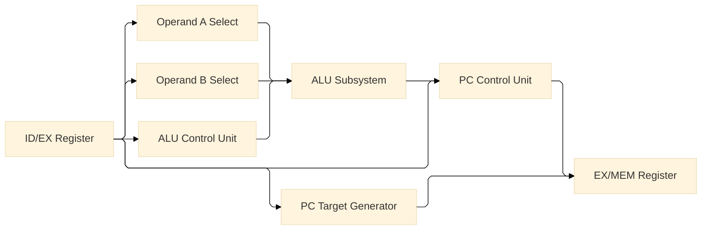

---

# 3. Inputs

| Signal | Width | Description |
|----------|--------|--------|
| valid | 1 | Instruction validity |
| PC | 32 | Program counter |
| rs1_data | 32 | Source operand A |
| rs2_data | 32 | Source operand B |
| immediate | 32 | Immediate value |
| funct3 | 3 | Function field |
| funct7 | 7 | Function field |
| ALUOp | 2 | ALU operation class |
| ALUSrc | 1 | Operand B selector |
| ALUSrcA | 1 | Operand A selector |
| I_TYPE_JALR | 1 | JALR indicator |

---

# 4. Outputs

| Signal | Width |
|----------|--------|
| ALU_Result | 32 |
| pc_target_address | 32 |
| branch_taken | 1 |

---

# 5. Operand Selection

The Execute stage receives source operands from the ID/EX pipeline register.
Before entering the ALU subsystem, the operands pass through two multiplexers
that select the appropriate inputs according to the control signals generated
during instruction decode.

---

## 5.1 Operand A Selection

The `operand_a_select_mux` selects the first ALU operand.

### Inputs

| Signal | Width | Description |
|---------|--------|--------|
| rs1_data | 32 | Source register value |
| PC | 32 | Program counter |
| ALUSrcA | 1 | Operand selection control |

### Output

| Signal | Width | Description |
|---------|--------|--------|
| Operand_A | 32 | First ALU operand |

### Selection Table

| ALUSrcA | Operand_A |
|----------|----------|
| 0 | rs1_data |
| 1 | PC |

### Usage

| Instruction Type | Operand_A |
|------------------|------------|
| R-Type | rs1 |
| I-Type | rs1 |
| Branch | rs1 |
| JAL | PC |
| AUIPC (future) | PC |

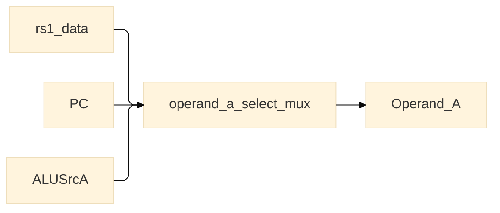

---

## 5.2 Operand B Selection

The `operand_b_select_mux` selects the second ALU operand.

### Inputs

| Signal | Width | Description |
|---------|--------|--------|
| rs2_data | 32 | Source register value |
| immediate | 32 | Immediate value |
| ALUSrc | 1 | Operand selection control |

### Output

| Signal | Width | Description |
|---------|--------|--------|
| Operand_B | 32 | Second ALU operand |

### Selection Table

| ALUSrc | Operand_B |
|---------|------------|
| 0 | rs2_data |
| 1 | immediate |

### Usage

| Instruction Type | Operand_B |
|------------------|------------|
| R-Type | rs2 |
| I-Type | immediate |
| Load | immediate |
| Store | immediate |
| Branch | rs2 |
| JALR | immediate |

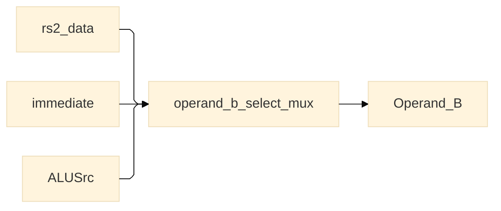

---

# 6. ALU Control Unit

The ALU control unit translates instruction metadata into an internal ALU operation code.

The unit receives:

- ALUOp
- funct3
- funct7
- valid

and generates:

- ALU_Control

---

## 6.1 Inputs

| Signal | Width |
|---------|--------|
| ALUOp | 2 |
| funct3 | 3 |
| funct7 | 7 |
| valid | 1 |

---

## 6.2 Output

| Signal | Width |
|---------|--------|
| ALU_Control | 4 |

---

## 6.3 ALUOp Classes

| ALUOp | Class |
|--------|--------|
| 00 | ADD-class |
| 01 | Branch-class |
| 10 | R-Type |
| 11 | I-Type |

---

## 6.4 ALU_Control Encoding

| ALU_Control | Operation |
|--------------|------------|
| 0000 | ADD |
| 0001 | SUB |
| 0010 | AND |
| 0011 | OR |
| 0100 | XOR |
| 0101 | SLL |
| 0110 | SRL |
| 0111 | SRA |
| 1000 | SLT |
| 1001 | SLTU |
| 1010 | Branch comparison |

**Note:** `1010` is reserved exclusively for branch instructions.

---

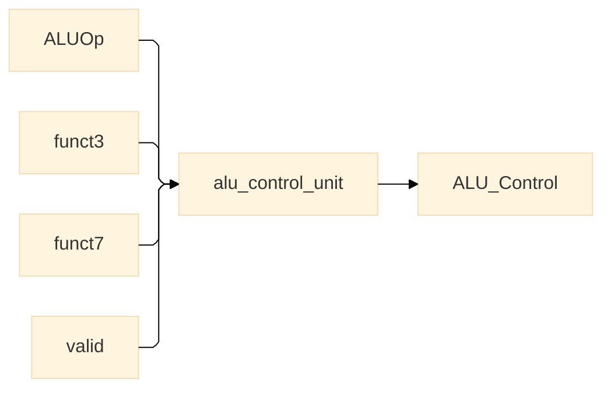

---

# 7. ALU Subsystem

The ALU subsystem performs arithmetic, logical, shift, comparison and branch operations.

The subsystem consists of:

- adder_subunit
- logic_subunit
- shift_subunit
- compare_subunit
- branch_comparator

A multiplexer selects the final output according to `ALU_Control`.

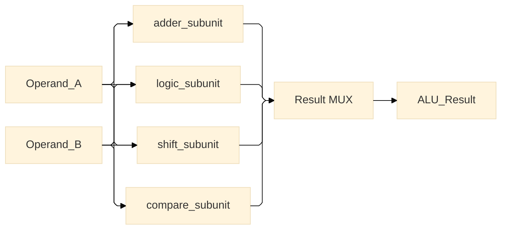

---

## 7.1 Adder Subunit

The `adder_subunit` implements the arithmetic operations of the processor.

Supported operations:

- ADD
- SUB

---

### Inputs

| Signal | Width | Description |
|---------|--------|--------|
| Operand_A | 32 | First operand |
| Operand_B | 32 | Second operand |

---

### Outputs

| Signal | Width | Description |
|---------|--------|--------|
| Result_ADD | 32 | Addition result |
| Result_SUB | 32 | Subtraction result |

---

### Operations

| Operation | Expression |
|------------|------------|
| ADD | Operand_A + Operand_B |
| SUB | Operand_A - Operand_B |

---

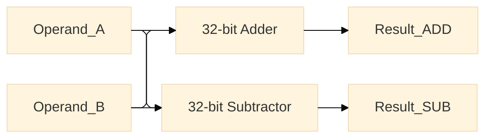

---

## 7.2 Logic Subunit

The `logic_subunit` performs bitwise logical operations.

Supported operations:

- AND
- OR
- XOR

---

### Inputs

| Signal | Width |
|---------|--------|
| Operand_A | 32 |
| Operand_B | 32 |

---

### Outputs

| Signal | Width |
|---------|--------|
| Result_AND | 32 |
| Result_OR | 32 |
| Result_XOR | 32 |

---

### Operations

| Operation | Expression |
|------------|------------|
| AND | Operand_A & Operand_B |
| OR | Operand_A \| Operand_B |
| XOR | Operand_A ^ Operand_B |

---

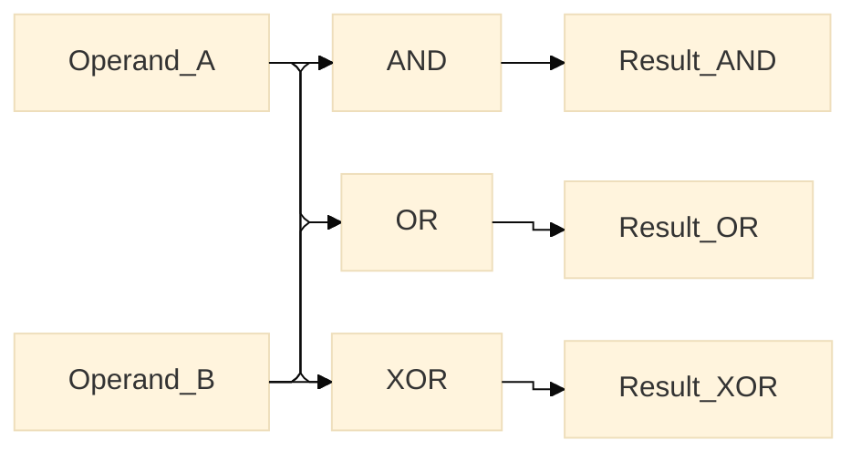

---

## 7.3 Shift Subunit

The `shift_subunit` performs bit-shift operations.

Supported operations:

- SLL
- SRL
- SRA

Only the least significant five bits of `Operand_B` are used as the shift amount.

---

### Inputs

| Signal | Width |
|---------|--------|
| Operand_A | 32 |
| Operand_B | 32 |

---

### Outputs

| Signal | Width |
|---------|--------|
| Result_SLL | 32 |
| Result_SRL | 32 |
| Result_SRA | 32 |

---

### Operations

| Operation | Expression |
|------------|------------|
| SLL | Operand_A << Operand_B[4:0] |
| SRL | Operand_A >> Operand_B[4:0] |
| SRA | Operand_A >>> Operand_B[4:0] |

---

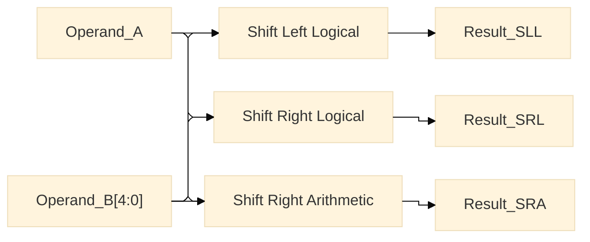

---

## 7.4 Compare Subunit

The `compare_subunit` performs signed and unsigned comparisons.

Supported operations:

- SLT
- SLTU

The comparison output is zero-extended to 32 bits.

---

### Inputs

| Signal | Width |
|---------|--------|
| Operand_A | 32 |
| Operand_B | 32 |

---

### Outputs

| Signal | Width |
|---------|--------|
| signed_less_than | 32 |
| unsigned_less_than | 32 |

---

### Operations

| Operation | Condition |
|------------|------------|
| SLT | Operand_A < Operand_B (signed) |
| SLTU | Operand_A < Operand_B (unsigned) |

---

### Result Encoding

| Condition | Result |
|------------|------------|
| True | 0x00000001 |
| False | 0x00000000 |

---

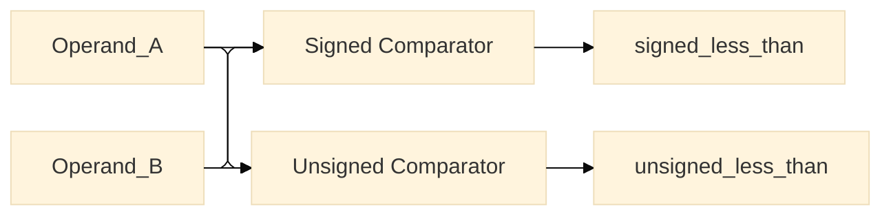

---

## 7.5 Branch Comparator

The `branch_comparator` evaluates conditional branch instructions.

The comparator operates only when:

- valid = 1
- branch_enable = 1

---

### Inputs

| Signal | Width |
|---------|--------|
| Operand_A | 32 |
| Operand_B | 32 |
| funct3 | 3 |
| branch_enable | 1 |
| valid | 1 |

---

### Output

| Signal | Width |
|---------|--------|
| branch_taken | 1 |

---

### Branch Conditions

| funct3 | Instruction | Condition |
|---------|--------|--------|
| 000 | BEQ | rs1 == rs2 |
| 001 | BNE | rs1 != rs2 |
| 100 | BLT | rs1 < rs2 (signed) |
| 101 | BGE | rs1 >= rs2 (signed) |
| 110 | BLTU | rs1 < rs2 (unsigned) |
| 111 | BGEU | rs1 >= rs2 (unsigned) |

---

### Branch Logic

```text
branch_taken = valid AND branch_enable AND selected_condition
```

---

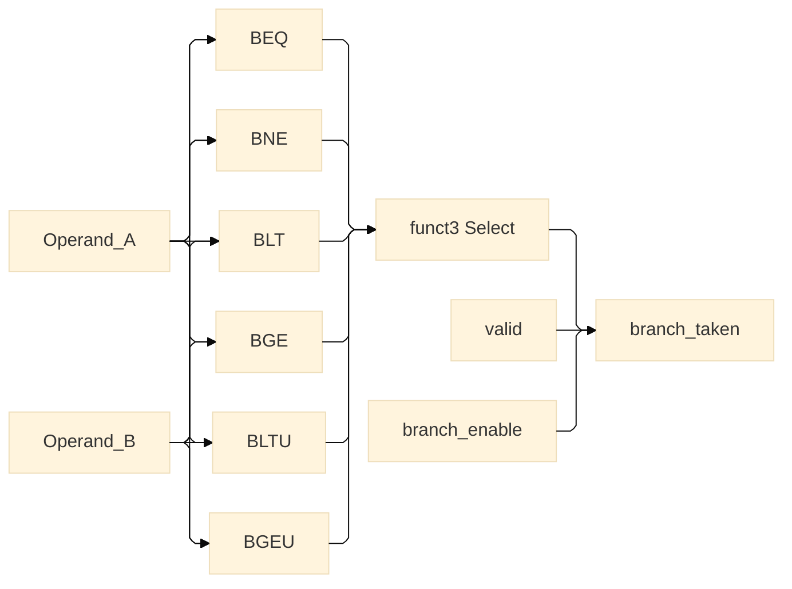
# 8. Control-Flow Subsystem

The control-flow subsystem is responsible for generating the next program counter
value for branch and jump instructions.

The subsystem consists of two modules:

- pc_target_address_generator
- pc_control_unit

The target address generator computes the destination address, while the PC
control unit determines whether the processor should transfer control to that
address.

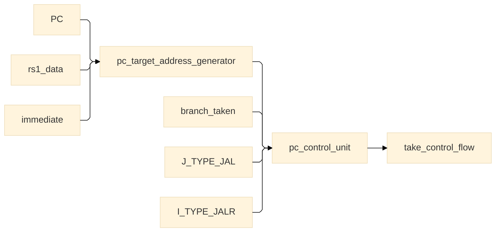

---

# 8.1 PC Target Address Generator

The `pc_target_address_generator` computes the destination address for branch
and jump instructions.

The target address depends on the instruction type.

---

## Inputs

| Signal | Width | Description |
|----------|--------|--------|
| PC | 32 | Current program counter |
| rs1_data | 32 | Source register |
| immediate | 32 | Immediate value |
| I_TYPE_JALR | 1 | JALR selector |

---

## Output

| Signal | Width | Description |
|----------|--------|--------|
| pc_target_address | 32 | Next target address |

---

## Target Address Computation

### Branch Instructions

```text
target = PC + immediate
```

---

### JAL

```text
target = PC + immediate
```

---

### JALR

```text
target = rs1_data + immediate
```

---

## Selection Logic

```text
if I_TYPE_JALR == 1

    pc_target_address = rs1_data + immediate

else

    pc_target_address = PC + immediate
```

---

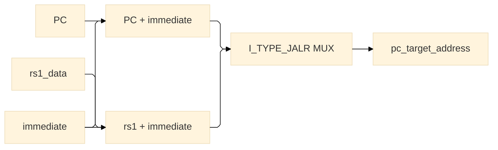


# 9. PC Control Unit

The `pc_control_unit` determines whether the processor continues sequential
execution or transfers control to a new address.

The unit evaluates:

- conditional branches
- JAL instructions
- JALR instructions

---

## Inputs

| Signal | Width | Description |
|----------|--------|--------|
| branch_taken | 1 | Branch comparator result |
| B_TYPE_BRANCH | 1 | Branch instruction indicator |
| J_TYPE_JAL | 1 | JAL instruction indicator |
| I_TYPE_JALR | 1 | JALR instruction indicator |

---

## Output

| Signal | Width | Description |
|----------|--------|--------|
| take_control_flow | 1 | Next-PC selection signal |

---

## Internal Logic

Branch instructions require both:

- a branch instruction
- a satisfied branch condition

Therefore:

```text
branch_jump = B_TYPE_BRANCH AND branch_taken
```

The final control-flow decision is:

```text
take_control_flow =
        branch_jump
     OR J_TYPE_JAL
     OR I_TYPE_JALR
```

---

## Control-Flow Table

| Instruction Type | Condition | take_control_flow |
|------------------|------------|--------|
| Normal instruction | — | 0 |
| BEQ/BNE/BLT/... | False | 0 |
| BEQ/BNE/BLT/... | True | 1 |
| JAL | Always | 1 |
| JALR | Always | 1 |

---

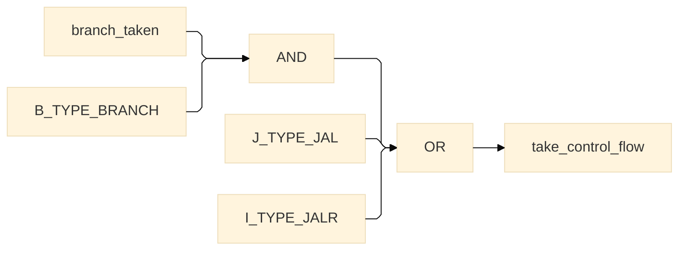

---

# 9.1 Interface with Instruction Fetch Stage

The signal `take_control_flow` is forwarded to the program counter selector
multiplexer in the Instruction Fetch stage.

Selection:

| take_control_flow | Next PC |
|-------------------|----------|
| 0 | PC + 4 |
| 1 | pc_target_address |

This mechanism allows the Execute stage to redirect instruction fetch when a
branch or jump instruction modifies program flow.

---

# 10. Pipeline Interface

The Execute stage is positioned between the Decode and Memory stages.

It receives instruction metadata, operands, and control signals from the ID/EX
pipeline register and produces computation results and control-flow decisions
for the EX/MEM pipeline register.

```text
Instruction Decode (ID)
           │
           ▼
     ID/EX Register
           │
           ▼
    Execute Stage (EX)
           │
           ▼
     EX/MEM Register
           │
           ▼
     Memory Stage (MEM)
```

---

## 10.1 Inputs from ID/EX Register

### Data Signals

| Signal | Width |
|----------|--------|
| PC | 32 |
| PC + 4 | 32 |
| rs1_data | 32 |
| rs2_data | 32 |
| immediate | 32 |

---

### Instruction Metadata

| Signal | Width |
|----------|--------|
| rd | 5 |
| funct3 | 3 |
| funct7 | 7 |

---

### Control Signals

| Signal | Width |
|----------|--------|
| RegWrite | 1 |
| MemRead | 1 |
| MemWrite | 1 |
| ALUSrc | 1 |
| ALUSrcA | 1 |
| ALUOp | 2 |
| WritebackSel | 3 |
| B_TYPE_BRANCH | 1 |
| J_TYPE_JAL | 1 |
| I_TYPE_JALR | 1 |

---

### Pipeline Control

| Signal | Width |
|----------|--------|
| valid | 1 |

---

## 10.2 Outputs to EX/MEM Register

### Execution Results

| Signal | Width |
|----------|--------|
| ALU_Result | 32 |
| pc_target_address | 32 |
| branch_taken | 1 |

---

### Forwarded Data

| Signal | Width |
|----------|--------|
| rs2_data | 32 |
| immediate | 32 |
| PC | 32 |

---

### Forwarded Metadata

| Signal | Width |
|----------|--------|
| rd | 5 |

---

### Forwarded Control Signals

| Signal | Width |
|----------|--------|
| RegWrite | 1 |
| MemRead | 1 |
| MemWrite | 1 |
| WritebackSel | 3 |

---

# 11. Parallel Execution Strategy

The Execute stage is organized around functional decomposition.

Instead of activating only a single functional unit, all major execution units
operate in parallel during every cycle.

The final result is selected by multiplexers using the decoded control signals.

---

## 11.1 Parallel Functional Units

The following units execute simultaneously:

- Arithmetic Unit
- Logic Unit
- Shift Unit
- Compare Unit
- Branch Comparator
- Target Address Generator

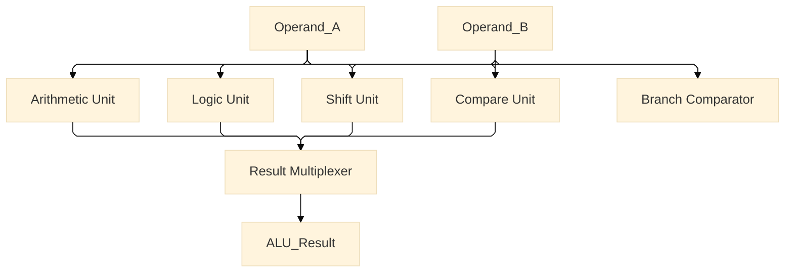

---

## 11.2 Result Selection

Although all functional units compute their outputs simultaneously, only one
result is committed as the architectural result of the instruction.

The result multiplexer selects the final output according to:

```text
ALU_Control
```

Branch instructions do not use the ALU result path directly.

Instead, the Branch Comparator independently generates:

```text
branch_taken
```

---

## 11.3 Design Philosophy

The Execute stage is organized by hardware functionality rather than by
instruction categories.

```text
ALU

├── Arithmetic Unit
├── Logic Unit
├── Shift Unit
├── Compare Unit
└── Branch Comparator
```

This organization was chosen to achieve:

- modularity
- simplified debugging
- clear signal flow
- easier verification
- straightforward hardware expansion

---

# 12. Architectural Decisions

The Execute stage follows several architectural principles that influenced its
implementation.

---

## 12.1 Hierarchical ALU Decoding

Instruction decoding is performed in two stages.

Stage 1:

```text
Opcode → ALUOp
```

Stage 2:

```text
ALUOp + funct3 + funct7 → ALU_Control
```

This hierarchical approach reduces decoding complexity and isolates the Execute
stage from direct opcode interpretation.

---

## 12.2 Dedicated Branch Comparator

Branch instructions are not implemented using ALU subtraction flags.

Instead, a dedicated Branch Comparator evaluates branch conditions separately.

Advantages:

- reduced datapath coupling
- simpler branch logic
- independent branch evaluation
- easier future extensions

---

## 12.3 Parallel Compare Architecture

Signed and unsigned comparisons are computed simultaneously.

```text
SLT
SLTU
```

No additional control signal is required to switch between comparison modes.

The final ALU result multiplexer selects the appropriate output.

---

## 12.4 Parallel Execution Model

All functional units remain active during execution.

Advantages:

- simpler implementation
- modular organization
- easier debugging
- compatibility with Logisim Evolution

Trade-off:

- increased hardware utilization

The project prioritizes architectural clarity and modularity over hardware
resource minimization.

---

## 12.5 Primitive Component Policy

The Execute stage uses Logisim Evolution primitives where appropriate:

- Adders
- Comparators
- Shifters
- Logic gates
- Multiplexers

The objective of the project is processor architecture exploration rather than
transistor-level arithmetic implementation.

---

# 13. Stall and Flush Interface

The Execute stage currently exposes interfaces for future pipeline control mechanisms.

The following signals have been provisioned in the design:

- stall
- flush

At the current stage of development, these interfaces are placeholders and have not yet been fully implemented or validated.

---

## 13.1 Stall Interface

Purpose (planned):

- freeze pipeline state
- preserve execution results
- resolve data hazards

Current status:

```text
Interface defined
Behavior not implemented
Not verified
```

Future implementation will integrate with:

- Hazard Detection Unit
- Forwarding Unit
- Pipeline control logic

---

## 13.2 Flush Interface

Purpose (planned):

- invalidate incorrect instructions
- clear pipeline state
- recover from branch redirection

Expected behavior:

```text
flush = 1

↓

valid = 0

↓

instruction becomes bubble
```

Current status:

```text
Interface defined
Behavior not implemented
Not verified
```

---

# 14. Verification Status

The Execute stage architecture has been completed.

Functional verification is still pending.

---

## 14.1 Structural Verification

| Module | Status |
|----------|--------|
| Operand Selection | ✓ Implemented |
| ALU Control Unit | ✓ Implemented |
| Arithmetic Unit | ✓ Implemented |
| Logic Unit | ✓ Implemented |
| Shift Unit | ✓ Implemented |
| Compare Unit | ✓ Implemented |
| Branch Comparator | ✓ Implemented |
| PC Target Generator | ✓ Implemented |
| PC Control Unit | ✓ Implemented |

---

## 14.2 Functional Verification

| Operation | Status |
|------------|--------|
| ADD | Pending |
| SUB | Pending |
| AND | Pending |
| OR | Pending |
| XOR | Pending |
| SLL | Pending |
| SRL | Pending |
| SRA | Pending |
| SLT | Pending |
| SLTU | Pending |
| BEQ | Pending |
| BNE | Pending |
| BLT | Pending |
| BGE | Pending |
| BLTU | Pending |
| BGEU | Pending |
| JAL | Pending |
| JALR | Pending |

---

Current status:

```text
Architecturally implemented
Functionally unverified
```

---

# 15. Future Extensions

The following features are planned for future development:

- Hazard Detection Unit
- Forwarding Unit
- Stall logic
- Flush logic
- Branch prediction
- CSR support
- Exception handling
- Interrupt handling
- Multiplication and division instructions
- Cache support
- Memory-mapped I/O

---

# 16. Revision History

| Version | Date | Description |
|----------|--------|--------|

| v1.0 | 2026-07-17 | Documentation draft |
| v1.1 | Future | Functional verification |
| v1.2 | Future | Hazard and forwarding support |

---
