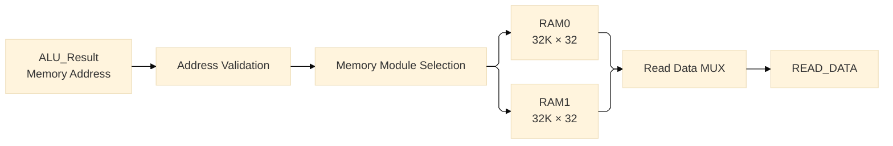
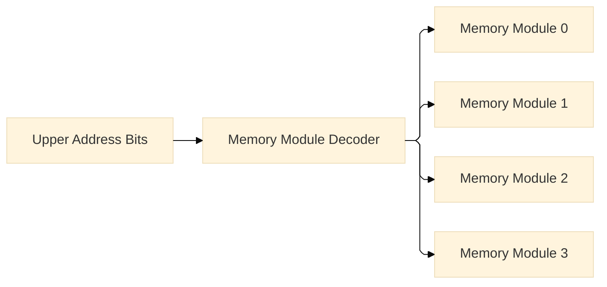
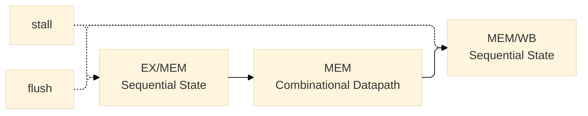

# 04 Memory Stage (MEM)

**Document Version:** v1.0  
**Last Updated:** 2026-07-20  10:20 IST
**Implementation Status:** Implemented

---

# 1. Overview

The Memory (MEM) stage is the fourth stage of the processor pipeline.

Its primary responsibility is to perform data-memory operations requested by
the Execute stage and to forward the resulting data and associated pipeline
information toward the Writeback stage.

The current implementation supports word-oriented memory operations:

- `LW` — Load Word
- `SW` — Store Word

The Memory stage performs:

- effective-address handling
- memory-address validation
- memory-module selection
- memory reads
- memory writes
- read-data generation
- forwarding of execution results and control information

Instructions that do not access data memory pass through the stage without
performing a memory transaction.

---

# 2. Pipeline Position

The processor uses a five-stage pipeline:

```text
IF → ID → EX → MEM → WB
```

The Memory stage is bounded by the EX/MEM and MEM/WB pipeline registers.


The EX/MEM register provides the state boundary entering the Memory stage,
while the MEM/WB register captures the results leaving it.

---

# 3. Responsibilities

The Memory stage is responsible for:

- receiving the effective address generated by the Execute stage
- receiving store data
- validating the requested memory address
- selecting the appropriate memory module
- performing memory reads
- performing memory writes
- generating memory read data
- forwarding ALU results for non-memory instructions
- forwarding destination-register information
- forwarding Writeback control information

---

# 4. Stage Inputs

The Memory stage receives its inputs from the EX/MEM pipeline register.

## 4.1 Datapath Inputs

| Signal | Width | Description |
|---|---:|---|
| `ALU_Result` | 32 | Effective address or Execute-stage result |
| `rs2_data` | 32 | Store data |
| `immediate` | 32 | Instruction immediate |
| `PC` | 32 | Program counter |

---

## 4.2 Instruction Metadata

| Signal | Width | Description |
|---|---:|---|
| `rd` | 5 | Destination register |
| `valid` | 1 | Pipeline instruction validity |

---

## 4.3 Control Inputs

| Signal | Width | Description |
|---|---:|---|
| `MemRead` | 1 | Enables a memory read |
| `MemWrite` | 1 | Enables a memory write |
| `RegWrite` | 1 | Indicates a register write |
| `WritebackSel` | 3 | Selects the Writeback source |

`WritebackSel` is implemented as a 3-bit signal to accommodate additional
Writeback sources in future revisions.

---

# 5. Stage Outputs

The Memory stage produces memory data and forwards the information required by
the Writeback stage.

## 5.1 Datapath Outputs

| Signal | Width | Description |
|---|---:|---|
| `READ_DATA` | 32 | Data returned by a memory read |
| `ALU_Result` | 32 | Forwarded Execute-stage result |
| `immediate` | 32 | Forwarded immediate |
| `PC` | 32 | Forwarded program counter |

---

## 5.2 Instruction Metadata

| Signal | Width | Description |
|---|---:|---|
| `rd` | 5 | Destination register |
| `valid` | 1 | Pipeline instruction validity |

---

## 5.3 Control Outputs

| Signal | Width | Description |
|---|---:|---|
| `RegWrite` | 1 | Register-file write enable |
| `WritebackSel` | 3 | Writeback source selection |

---

# 6. Memory Subsystem Architecture

The data-memory subsystem is organized as a modular, multi-bank memory.

The current implementation contains two RAM modules:

```text
RAM0 : 32K × 32
RAM1 : 32K × 32
```

The surrounding logic provides:

- address validation
- memory-module selection
- read-data selection
- read enable qualification
- write enable qualification



The memory subsystem is independent of the instruction-memory subsystem.

---

# 7. Memory Organization

Each RAM module is configured as:

```text
32K × 32 bits
```

Therefore:

```text
32K words × 4 bytes

= 128 KB per module
```

The current two-module configuration provides:

```text
2 × 128 KB

= 256 KB total data memory
```

The memory modules are treated as independent banks within a larger
architectural address space.

---

# 8. RISC-V Addressing Model

RISC-V uses byte-addressed memory.

Therefore, all addresses generated by the processor represent byte addresses.

The implemented RAM modules contain 32-bit words, where:

```text
1 word = 4 bytes
```

Consequently, the CPU byte address must be converted to a word address when
indexing the RAM.

```text
Word_Address = Byte_Address >> 2
```

For the currently supported `LW` and `SW` operations, the lower two address
bits represent the byte offset within the 32-bit word.

```text
Address[1:0]
```

are therefore not used for word selection.

These bits remain architecturally meaningful for future byte and halfword
operations.

---

# 9. Address Decomposition

The processor uses a 32-bit byte address.

The current memory architecture divides this address into three conceptual
regions:

```text
31                18 17          2 1    0

+------------------+--------------+------+
| Future Expansion | Local Address|Offset|
+------------------+--------------+------+
```

| Address Bits | Purpose |
|---|---|
| `Address[1:0]` | Byte offset |
| `Address[16:2]` | Local word address within a memory module |
| `Address[17+]` | Memory-module selection / future expansion |

This decomposition separates:

1. the byte offset,
2. the address inside an individual memory module, and
3. the address space used to select additional memory modules.

---

# 10. Memory Module Selection

The architecture reserves the upper address bits for memory-module selection.

For the current two-module configuration:

```text
2 Banks → Address[17]
```

As the number of modules increases, additional upper bits are introduced:

```text
2 Banks   → Address[17]

4 Banks   → Address[18:17]

8 Banks   → Address[19:17]

16 Banks  → Address[20:17]
```

The selected upper address bits are supplied to decoder or demultiplexer logic
to generate individual module-select signals.

The lower address bits continue to index locations within the selected module.

---

# 11. Address Expansion Model

The memory architecture is designed so that memory capacity can be increased
without changing the CPU address width or the processor pipeline.

For example:

```text
Current:

Address[17]
     │
     ▼
  2 modules
```

Future:

```text
Address[18:17]
     │
     ▼
  4 modules
```

and:

```text
Address[19:17]
     │
     ▼
  8 modules
```

The additional address bits should feed a decoder or demultiplexer.



The internal address of every memory module remains based on the lower address
bits.

---

# 12. Address Validation

The current implementation validates whether the generated address belongs
to the currently implemented memory region.

The current validity condition is:

```text
memory_valid = NOT(OR(Address[31:18]))
```

This ensures that addresses outside the currently implemented region do not
activate the data-memory modules.

The memory-control signals are qualified by the validity condition:

```text
MemRead_effective = MemRead AND memory_valid
```

```text
MemWrite_effective = MemWrite AND memory_valid
```

This prevents an invalid CPU address from generating an active RAM read or
write operation.

---

# 13. Memory Read Operation

The current data-memory implementation uses **asynchronous reads**.

The read path is therefore combinational:

```text
Address
   │
   ▼
Address Validation
   │
   ▼
Module Selection
   │
   ▼
Selected RAM
   │
   ▼
READ_DATA
```

When `MemRead` is asserted and the address is valid, the selected RAM produces
the corresponding 32-bit data without waiting for a clock edge.

This allows the load instruction to complete its memory access within the
existing MEM stage.

---

# 14. Memory Write Operation

Store operations use the memory write interface.

When `MemWrite` is asserted and the address is valid:

```text
Memory[Address] ← rs2_data
```

The store data originates from the `rs2` register value captured during Decode
and propagated through the ID/EX, Execute, and EX/MEM stages.

The RAM write operation occurs synchronously with the memory clock.

---

# 15. Load Word Data Flow

For an `LW` instruction:

```text
LW
 │
 ▼
Decode
 │
 ▼
Execute
 │
 └── Effective Address
          │
          ▼
       EX/MEM
          │
          ▼
        MEM
          │
          ▼
      RAM Read
          │
          ▼
      READ_DATA
          │
          ▼
       MEM/WB
          │
          ▼
        WB
          │
          ▼
     Register File
```

The asynchronous read avoids introducing an additional memory-read cycle into
the current five-stage pipeline.

---

# 16. Store Word Data Flow

For an `SW` instruction:

```text
SW
 │
 ▼
Decode
 │
 ▼
Execute
 │
 ├── Effective Address
 │
 └── Store Data
          │
          ▼
       EX/MEM
          │
          ▼
        MEM
          │
          ▼
      RAM Write
```

Store instructions do not require a register-file Writeback operation.

---

# 17. Non-Memory Instructions

Instructions that do not access data memory pass through the Memory stage
without activating the RAM subsystem.

Examples include:

- arithmetic instructions
- logical instructions
- shift instructions
- comparison instructions
- jump instructions
- branch instructions

For these instructions:

```text
MemRead  = 0
MemWrite = 0
```

The `ALU_Result`, destination register, validity, and relevant Writeback
control information are forwarded toward MEM/WB.

---

# 18. Pipeline Control Boundary

The Memory stage itself is a **combinational datapath**.

`stall` and `flush` are not part of the normal memory-access computation.

They belong to the sequential pipeline-control mechanism and operate on
pipeline state at register boundaries.

Conceptually:



The detailed implementation of stall, flush, reset, and clocked state belongs to
the corresponding pipeline-register documentation.

---

# 19. Memory Timing Decision

The current architecture intentionally uses:

```text
Read  → Asynchronous
Write → Synchronous
```

The asynchronous-read decision was made to preserve the existing five-stage
pipeline:

```text
IF → ID → EX → MEM → WB
```

without introducing an additional memory stage for load instructions.

With asynchronous reads, the memory data becomes available during the MEM
stage once the address has propagated through the memory subsystem.

A synchronous-read implementation would delay the availability of load data
and would require corresponding changes to pipeline timing and hazard
management.

Possible future consequences of synchronous memory include:

- load-use hazard handling
- additional forwarding requirements
- pipeline stalls
- additional pipeline staging
- revised memory timing

The current implementation therefore prioritizes architectural simplicity,
modularity, and straightforward verification.

---

# 20. Architectural Design Decisions

## 20.1 Modular Memory Organization

The data memory is divided into independent modules rather than represented
as one monolithic memory block.

This allows capacity to be expanded through additional module-selection logic.

---

## 20.2 Upper Address Bits for Expansion

The address bits beginning at `Address[17]` are reserved for memory-module
selection as the memory system expands.

This allows the local address inside each memory module to remain unchanged.

---

## 20.3 Word-Oriented Initial Implementation

The initial implementation is designed around 32-bit word accesses.

Therefore:

```text
Address[1:0]
```

are currently unused for `LW` and `SW`.

They remain available for future implementation of:

- `LB`
- `LH`
- `LBU`
- `LHU`
- `SB`
- `SH`

---

## 20.4 Asynchronous Memory Read

Asynchronous read was selected to avoid adding an additional pipeline stage or
load latency during the initial processor implementation.

The decision is implementation-specific and does not change the RISC-V
byte-addressed memory model.

---

# 21. Future Expansion

The memory architecture provides a foundation for future extensions.

Planned or possible extensions include:

- byte loads
- halfword loads
- unsigned byte and halfword loads
- byte stores
- halfword stores
- additional RAM modules
- memory-mapped I/O
- UART memory mapping
- timer peripherals
- cache subsystem
- synchronous memory implementation
- memory protection
- memory-access exceptions

Future memory expansion should be implemented by extending the memory
selection hierarchy rather than modifying the processor's fundamental address
interface.

---

# 22. Related Modules

The Memory stage is directly related to the following modules:

| Module | Relationship |
|---|---|
| `EX/MEM Pipeline Register` | Provides the effective address, store data, metadata, and memory-control signals |
| `Data Memory Subsystem` | Performs the actual RAM access |
| `Memory Address Validation` | Determines whether the generated address is within the implemented memory space |
| `Memory Module Selection` | Selects the appropriate RAM module using upper address bits |
| `MEM/WB Pipeline Register` | Captures memory data and forwarded execution information |
| `Execute Stage` | Generates the effective address for load/store operations |
| `Writeback Stage` | Consumes memory data or forwarded ALU results |
| `Register File` | Receives loaded values through the Writeback stage |

The instruction-memory subsystem is architecturally independent from the data
memory subsystem.

---

# 23. Implementation Status

The following components are implemented as part of the current Memory-stage
architecture:

- dual `32K × 32` RAM organization
- memory address routing
- memory-module selection
- address validation
- asynchronous read path
- synchronous write path
- load-data path
- store-data path
- EX/MEM to MEM datapath
- MEM to MEM/WB datapath
- memory expansion interface

Current state:

```text
Memory Stage
    │
    ├── Hardware: Implemented
    └── Functional verification: Pending
```

Functional verification remains a separate testing phase and is not implied by
the implementation status.

---

# 24. Verification Scope

The Memory stage will requires dedicated functional testing for:

- `LW`
- `SW`
- correct effective-address routing
- correct word-address conversion
- correct memory-module selection
- correct read-data propagation
- correct store-data propagation
- invalid-address handling
- MEM/WB data transfer
- interaction with Writeback
- non-memory instruction bypass behavior

---

# 25. Revision History

| Version | Date | Description |
|---|---|---|
| v1.0 | 2026-07-20 | Initial consolidated Memory-stage architecture documentation |