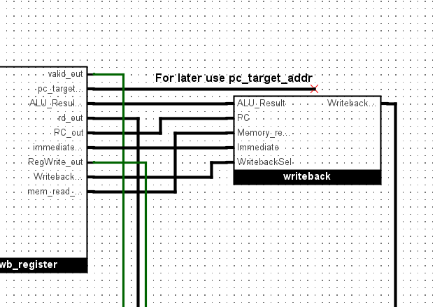
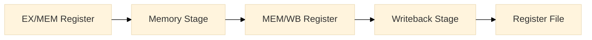
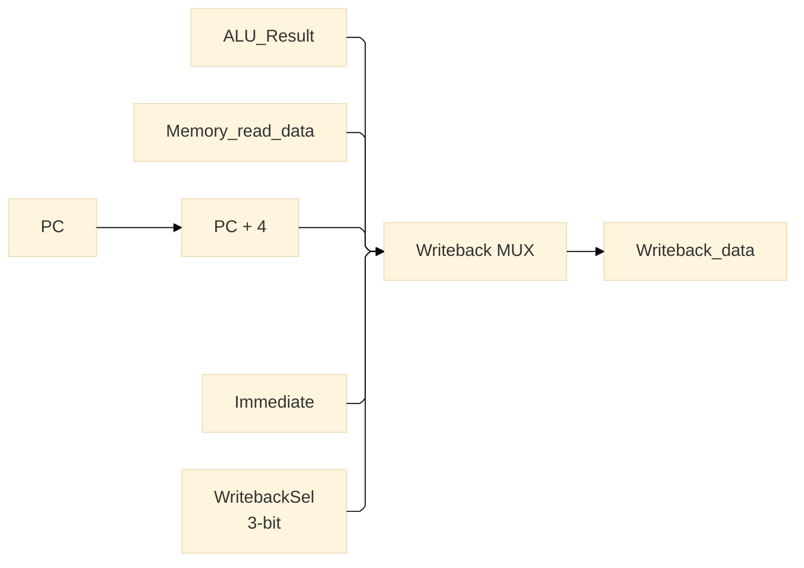
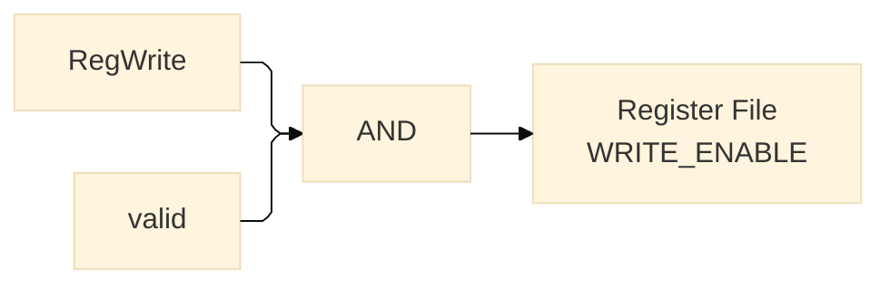
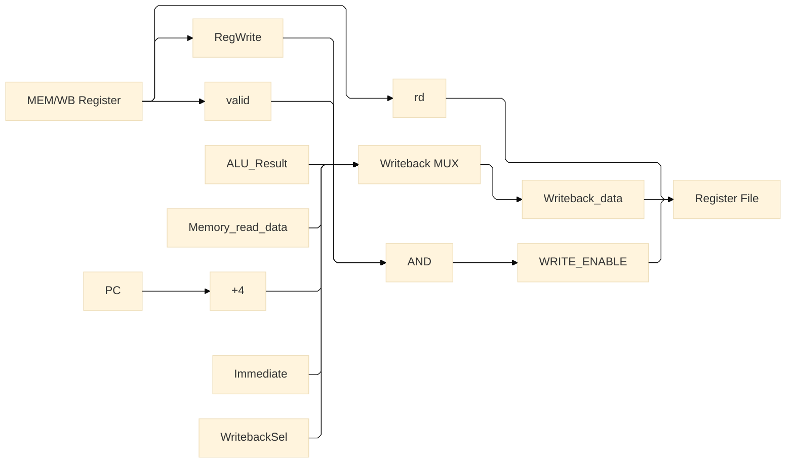
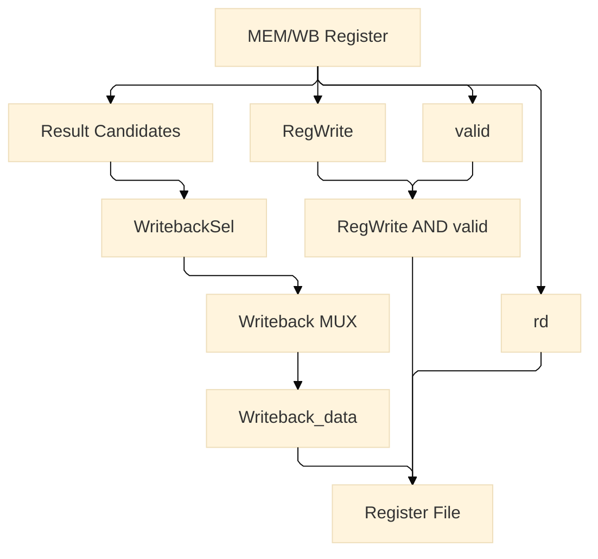

# 05 — Writeback Stage

**Implementation Status**: Implemented
**Last Updated**: 2026-07-31 00:49 IST
**Document Type**: Pipeline Stage Architecture Specification

---

## 1. Purpose

The Writeback (WB) stage is the final pipeline stage responsible for selecting the value produced by the instruction for architectural register-file writeback.

The stage receives the required result candidates and control information from the MEM/WB pipeline register, selects the appropriate value according to `WritebackSel`, and presents the selected value to the register-file write-data interface.

The stage also participates in the register-file write-enable decision through the combination of:

* `RegWrite`
* `valid`

The register file itself is maintained as a separate architectural subsystem and is referenced by this stage rather than being structurally incorporated into the Writeback block.

---

## 2. Architectural Position

The Writeback stage follows the MEM stage and the `mem_wb_register`.



The WB stage is therefore the final point at which an instruction's computed architectural result is selected before it is committed to the register file.

---

## 3. Interface

### 3.1 Inputs

The Writeback stage receives the following inputs from the MEM/WB pipeline register:

| Signal             | Width | Source                | Function                                                        |
| ------------------ | ----: | --------------------- | --------------------------------------------------------------- |
| `ALU_Result`       |    32 | MEM/WB                | Arithmetic, logical, comparison, or address result              |
| `PC`               |    32 | MEM/WB                | Program-counter value associated with the instruction           |
| `Memory_read_data` |    32 | Data-memory subsystem | Loaded memory value                                             |
| `Immediate`        |    32 | MEM/WB                | Immediate value carried through the pipeline                    |
| `WritebackSel`     |     3 | MEM/WB                | Selects the writeback source                                    |
| `RegWrite`         |     1 | MEM/WB                | Indicates that the instruction requests register-file writeback |
| `valid`            |     1 | MEM/WB                | Indicates that the pipeline entry contains a valid instruction  |

The implementation currently exposes the above result candidates to the writeback selection logic.

---

---
## 4. Writeback Data Selection

The central combinational element of the WB stage is the `WritebackSel` multiplexer.

The implemented result sources are:

1. `ALU_Result`
2. `Memory_read_data`
3. `PC + 4`
4. `Immediate`

The `PC + 4` value is generated within the writeback logic from the carried `PC` value rather than requiring a separate pipeline signal for the incremented address.



The MUX is purely combinational. No state is introduced by the selection operation.

---

## 5. Writeback Source Classes

### 5.1 ALU Result

`ALU_Result` is selected for instructions whose architectural destination is the result produced by the execution-stage ALU.

This includes the ordinary arithmetic, logical, comparison, and address-generation result path as defined by the instruction/control architecture.

---

### 5.2 Memory Read Data

`Memory_read_data` is selected for load instructions.

The memory stage supplies the value obtained from the data-memory subsystem, which is carried through the MEM/WB pipeline register and presented to the WB MUX.

The WB stage therefore does not perform the memory access itself. It only selects the already-produced memory value for architectural writeback.

---

### 5.3 PC + 4

The WB stage provides a `PC + 4` candidate for instructions that require the sequential return address as their architectural result.

This is required for the link instructions, including the implemented JAL/JALR classes.

The implementation generates this value using an adder:

```text
PC ──► +4 ──► PC + 4 ──► Writeback MUX
```

The presence of this path allows the link address to be written into the destination register through the same writeback mechanism used by the other instruction classes.

---

### 5.4 Immediate

`Immediate` is provided as an additional writeback source.

This supports instruction classes for which the immediate value itself forms the architectural result.

The immediate value has already been generated earlier in the pipeline and carried forward through the appropriate pipeline registers.

---

## 6. Writeback Selection Control

`WritebackSel` is a **3-bit control signal**.

The 3-bit width provides eight possible encodings while the current implementation requires only the implemented writeback source classes.

This encoding width is intentionally retained to provide capacity for additional writeback sources in future architectural extensions.

The exact encoding assigned to each source is defined by the control-path implementation and shall remain consistent between the control unit, pipeline registers, and WB MUX.

### Current architectural candidates

| Candidate        | Source             |
| ---------------- | ------------------ |
| ALU result       | `ALU_Result`       |
| Memory result    | `Memory_read_data` |
| Link result      | `PC + 4`           |
| Immediate result | `Immediate`        |

Unused `WritebackSel` encodings are reserved for future architectural expansion and shall not be assigned new semantics without corresponding updates to the control architecture.

---

## 7. Register-File Write Enable

The register file is written only when both the instruction is valid and the instruction's control path requests register writeback.

The implementation performs this qualification using an AND gate:



Functionally:

```text
WRITE_ENABLE = RegWrite AND valid
```

This qualification prevents an invalid pipeline entry from causing an architectural register write even if its propagated control fields contain an asserted `RegWrite`.

---

## 8. Register-File Interface

The register file is architecturally external to the Writeback block.

The WB stage provides:

* destination register address
* selected writeback data
* qualified write enable

The register-file subsystem provides the physical storage and register access implementation.



The register-file implementation is documented separately under the architectural register-file documentation.

---

## 9. Combinational Nature of the Stage

The Writeback data-selection path is combinational.

The following operations occur without introducing a WB-stage storage element:

1. Selection of the writeback source.
2. Generation of `PC + 4`.
3. Qualification of the register-file write enable.

The architectural state update occurs at the register-file write interface under the register file's clocked write mechanism.

Consequently, `stall` and `flush` do not participate in the WB combinational data-selection logic.

Pipeline control signals affecting sequential state belong to the pipeline-register/control architecture rather than the combinational writeback datapath.

---

## 10. Data Flow

For a generic instruction reaching WB:



The selected value and destination register therefore converge at the register-file interface, while the write-enable qualification determines whether the architectural update occurs.

---

## 11. Instruction-Class Behavior

The WB stage does not independently decode instructions.

Instead, the preceding control architecture determines `WritebackSel` and `RegWrite`.

The resulting behavior is therefore:

| Instruction result class   | Writeback source   |
| -------------------------- | ------------------ |
| ALU-produced result        | `ALU_Result`       |
| Load result                | `Memory_read_data` |
| Link/return-address result | `PC + 4`           |
| Immediate-produced result  | `Immediate`        |

The WB stage remains intentionally generic and does not need to know the instruction opcode or instruction format.

---

## 12. Pipeline Timing

The Writeback stage consumes values captured by the MEM/WB register.

At the architectural level:

```text
Cycle N:
    MEM stage produces results

Clock edge:
    MEM/WB captures results

Cycle N+1:
    WB selects writeback source
    WB presents writeback_data
    Register file receives qualified write enable
```

The exact register-file write timing is governed by the register-file subsystem's clocking implementation.

---

## 13. Architectural Invariants

The following invariants shall hold:

1. `Writeback_data` must correspond to exactly one selected writeback source.
2. `WritebackSel` must be generated consistently with the instruction's control classification.
3. An invalid pipeline entry shall not modify the register file.
4. `RegWrite = 0` shall prevent a register-file write.
5. `valid = 0` shall prevent a register-file write.
6. Load instructions shall receive their architectural result from `Memory_read_data`.
7. Link instructions shall receive `PC + 4`.
8. The destination register address shall be carried through the pipeline without modification.
9. The WB datapath shall remain combinational.
10. Unused `WritebackSel` encodings shall remain reserved until explicitly assigned by an architectural revision.

---

## 14. Verification Considerations

The following functional cases shall be verified before the Writeback stage is considered fully verified:

### 14.1 ALU Writeback

Verify that an ALU-producing instruction writes `ALU_Result` into the specified destination register.

### 14.2 Load Writeback

Verify that a load instruction writes `Memory_read_data` into the specified destination register.

### 14.3 Link Writeback

Verify that JAL/JALR-class instructions write the appropriate `PC + 4` value into the destination register.

### 14.4 Immediate Writeback

Verify that an instruction using the immediate writeback path writes the propagated `Immediate` value correctly.

### 14.5 Invalid Instruction

Verify that:

```text
valid = 0
```

prevents register-file modification even when `RegWrite` is asserted.

### 14.6 RegWrite Disabled

Verify that:

```text
RegWrite = 0
```

prevents the architectural register update.

### 14.7 Writeback Selection

Verify every currently assigned `WritebackSel` encoding and confirm that unused encodings cannot accidentally select an unintended architectural value.

---

## 15. Related Modules

The Writeback stage interfaces with:

* `mem_wb_register`
* `register_file_subsystem`
* `data_memory_subsystem`
* `writeback`
* Main control/decode path generating `RegWrite`
* Main control/decode path generating `WritebackSel`

The detailed implementation of the register file is maintained separately and is referenced by this stage documentation.

---

## 16. Implementation Notes

The current implementation uses a **3-bit `WritebackSel`** even though the presently implemented writeback source set occupies fewer than eight possible selections.

This is intentional architectural headroom for future extensions.

The current implementation also generates `PC + 4` locally in the WB selection path from the carried `PC` value.

No additional pipeline state is introduced by the writeback selection logic.

---

## 17. Implementation Status

**Implementation Status**: Implemented

The Writeback stage datapath, writeback-source selection, `PC + 4` generation, and register-file write-enable qualification are implemented in the current design.

The register-file subsystem remains a separately documented architectural module.

---

## 18. Revision History

| Revision | Date           | Description                                                                                       |
| -------- | -------------- | ------------------------------------------------------------------------------------------------- |
| 1.0      | 29 July 2026 | Initial formal documentation of the implemented Writeback stage                                   |
| 1.1      | 30 July 2026 | Documented 3-bit `WritebackSel`, external register-file interface, and write-enable qualification |

---
