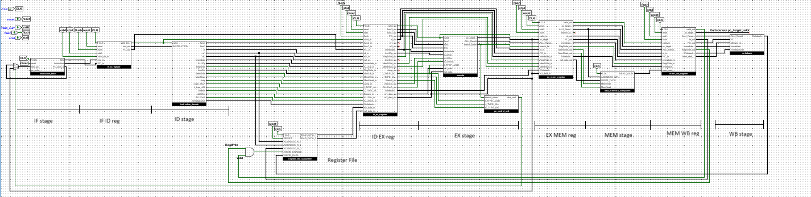

# Complete RISC-V Computer in Logisim Evolution

> Building a computer system from scratch using digital logic.
 
---
#### NOTE: This is a long-term educational project that is developed incrementally, with each subsystem designed and documented before integration.
---
## Overview

This project aims to design and implement a fully functional **32-bit RISC-V computer** inside 
Logisim Evolution using only digital hardware primitives.

The goal is not just to build a CPU, but to engineer a computer system including:

- Pipelined RISC-V CPU
- Memory hierarchy
- System bus
- Interrupt system
- UART console
- DMA engine
- GPU / VGA output
- Storage interfaces
- OS support infrastructure
- Toolchain integration

The system is being built from the ground up with a strong focus on:

- Computer architecture
- Hardware engineering principles
- Clean modular design
- Scalability
- Realistic datapath organization
- Pipeline correctness
- Documentation and architectural reasoning

---

# Project Goals

## Primary Goals

- Build a RV32I pipelined processor
- Execute real compiled RISC-V programs
- Run programs written in C
- Create a scalable computer architecture
- Learn low-level hardware engineering deeply
- Simulate realistic processor behavior

---

## Long-Term Goals

- RV32IM support
- Cache hierarchy
- Interrupt handling
- VGA graphics output
- DMA subsystem
- Virtual memory support
- Minimal operating system
- Storage subsystem
- Advanced debugging tools
- Potential multi-core experimentation

---

# ISA Target

| Feature | Value |
|---|---|
| ISA | RV32I |
| Future ISA | RV32IM |
| Word Size | 32-bit |
| Endianness | Little Endian |
| Register Count | 32 |
| Pipeline | 5-stage |
| Clocking | Single synchronous clock |

---

# CPU Architecture

The processor follows a classic 5-stage RISC-V pipeline:

```text
IF -> ID -> EX -> MEM -> WB
````

---

# Pipeline Stages

## Instruction Fetch (IF)

Responsible for:

* Program Counter management
* Instruction fetching
* Branch target selection
* PC increment logic

### Main Components

* Program Counter
* PC Incrementer
* Branch Target Adder
* Instruction Memory Interface
* IF/ID Pipeline Register

---

## Instruction Decode (ID)

Responsible for:

* Instruction decoding
* Register reads
* Immediate generation
* Control signal generation
* Hazard detection

### Main Components

* Register File
* Immediate Generator
* Main Control Unit
* Hazard Detection Unit
* Instruction Splitter
* ID/EX Pipeline Register

---

## Execute (EX)

Responsible for:

* Arithmetic operations
* Logic operations
* Branch evaluation
* Forwarding
* ALU control

### Main Components

* ALU
* ALU Control Unit
* Forwarding Unit
* Branch Comparator
* Operand Select MUXes
* EX/MEM Pipeline Register

---

## Memory (MEM)

Responsible for:

* Load/store execution
* Memory alignment
* MMIO handling
* Cache integration (future)

### Main Components

* Load/Store Unit
* Data Memory Interface
* Memory Alignment Unit
* MMIO Decoder
* MEM/WB Pipeline Register

---

## Writeback (WB)

Responsible for:

* Writing results back to registers

### Main Components

* Writeback MUX
* Register Write Controller

---

# Top-Level Design Philosophy

This project follows several important engineering principles:

## Modular Design

Every subsystem is implemented as an isolated reusable hardware module.

---

## Bottom-Up Engineering

Each component is defined with:

* Exact inputs/outputs
* Signal widths
* Timing behavior
* Control logic
* Internal datapaths

No ambiguous behavior is allowed.

---

## Scalable Architecture

The design intentionally leaves room for:

* caches
* DMA
* GPU
* MMU
* privilege modes
* advanced pipeline features

without requiring a complete redesign later.

---

## Realistic Hardware Constraints

The implementation attempts to work with real-world computer architecture concepts:

* pipeline hazards
* forwarding
* stalls
* branch penalties
* bus arbitration
* memory timing
* alignment behavior

---

# Planned Features

## CPU Features

* [x] RV32I base architecture
* [ ] RV32IM extension
* [ ] CSR support
* [ ] Exceptions and traps
* [ ] Privilege modes
* [ ] Branch prediction

---

## Memory Features

* [x] Boot ROM
* [x] Main RAM
* [ ] Instruction cache
* [ ] Data cache
* [ ] MMU
* [ ] Virtual memory

---

## IO Features

* [ ] UART
* [ ] Timers
* [ ] GPIO
* [ ] Keyboard input
* [ ] Mouse input
* [ ] Audio controller

---

## Graphics Features

* [ ] VGA controller
* [ ] Framebuffer
* [ ] Sprite engine
* [ ] 2D acceleration

---

## Storage Features

* [ ] SD card interface
* [ ] Virtual disk
* [ ] Filesystem layer

---

# Current Development Status

## In Progress

* CPU datapath planning
* Hazard Unit
* Architectural decomposition
* CSRs

---

# Documentation Philosophy

This repository treats architecture documentation as a first-class engineering artifact.

The project maintains:

* architecture notes
* implementation decisions
* debugging reports
* timing analysis
* future expansion plans
* performance analysis

The goal is to document not only *what* was built, but also:

* why it was built that way
* what alternatives were considered
* what problems occurred during implementation

---

# Tools & Technologies

| Tool                 | Purpose                |
| -------------------- | ---------------------- |
| Logisim Evolution    | Hardware simulation    |
| RISC-V GCC Toolchain | Program compilation    |
| RISC-V ISA           | Processor architecture |
| Markdown             | Documentation          |
| Git/GitHub           | Version control        |

---

# Software Toolchain

The project uses a standard RISC-V embedded software toolchain
to compile and prepare programs for execution on the simulated hardware.


## Compiler

```text
riscv32-unknown-elf-gcc
````

Used for:

* C compilation
* low-level runtime generation
* executable generation

---

## Assembler

```text
GNU binutils
```

Used for:

* Assembly compilation
* object generation
* linking support

---

## Binary Utilities

Utilities used during development:

```text
objcopy
objdump
```

These tools assist with:

* ELF inspection
* disassembly
* binary extraction
* memory image generation

---

## Languages

Primary development languages:

* C
* RISC-V Assembly
* Python (tooling and automation)

---

## Automation Pipeline

Planned automation tooling includes:

* ELF to memory image conversion
* ROM/RAM image generation
* automated build scripts
* executable packaging
* simulation test harnesses


# Development Workflow

The software and hardware development process will follow a complete
cross-compilation and simulation workflow.

---

## Workflow


1. Write C/Assembly program
2. Compile using RISC-V GCC
3. Link with custom linker script
4. Convert ELF to flat binary
5. Generate Logisim memory image
6. Load image into simulated RAM/ROM
7. Execute on custom computer


---

## Workflow Goals

This workflow enables:

* rapid hardware validation
* realistic software testing
* executable-level debugging
* operating system experimentation
* compiler compatibility testing

The long-term objective is to create a hardware/software co-design environment.


---

# Inspirations

This project draws inspiration from:

* classic RISC architectures
* educational CPU projects
* modern processor pipelines
* operating system development
* hardware engineering workflows

---

# Why This Project Exists

This project attempts to:

> Build a real computer architecture progressively,
> understand every signal path,
> and document the entire engineering journey.

---

# License

MIT License (planned)

---

# Project Status

🚧🚧🚧 Active Development 🚧🚧🚧

This project is evolving continuously as the architecture matures.

---

# Author

Built as a long-term computer engineering and architecture project.

~ AtharvM2411

